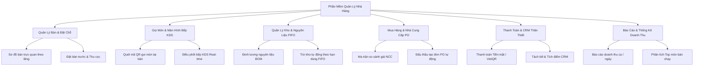

# BÁO CÁO ĐỀ TÀI MÔN HỌC: HỆ QUẢN TRỊ CƠ SỞ DỮ LIỆU
## TÊN ĐỀ TÀI: THIẾT KẾ VÀ CÀI ĐẶT CƠ SỞ DỮ LIỆU PHẦN MỀM QUẢN LÝ NHÀ HÀNG
**Hệ thống:** Restaurant Management & Smart POS System  
**Hệ quản trị CSDL:** MySQL 8.0+ / MariaDB 10.4+ (InnoDB Engine)  
**Công nghệ tích hợp:** Laravel Framework (PHP 8.2), Blade Engine, MySQL, JavaScript / AJAX Real-time

---

## MỤC LỤC BÁO CÁO

- [PHẦN 1: KHẢO SÁT NGHIỆP VỤ ĐỀ TÀI](#phần-1-khảo-sát-nghiệp-vụ-đề-tài)
  - [1.1. Lĩnh vực hoạt động](#11-lĩnh-vực-hoạt-động)
  - [1.2. Các đối tượng tham gia](#12-các-đối-tượng-tham-gia)
  - [1.3. Các chức năng chính của hệ thống](#13-các-chức-năng-chính-của-hệ-thống)
  - [1.4. Các quy trình nghiệp vụ và quy định nghiệp vụ tương ứng](#14-các-quy-trình-nghiệp-vụ-và-quy-định-nghiệp-vụ-tương-ứng)
  - [1.5. Các chứng từ, báo cáo mà hệ thống cần quản lý](#15-các-chứng-từ-báo-cáo-mà-hệ-thống-cần-quản-lý)
- [PHẦN 2: THIẾT KẾ HỆ THỐNG CƠ SỞ DỮ LIỆU](#phần-2-thiết-kế-hệ-thống-cơ-sở-dữ-liệu)
  - [2.1. Lược đồ quan hệ CSDL (Dạng dòng chuẩn)](#21-lược-đồ-quan-hệ-csdl-dạng-dòng-chuẩn)
  - [2.2. Thiết kế CSDL (DDL & Ràng buộc toàn vẹn)](#22-thiết-kế-csdl-ddl--ràng-buộc-toàn-vẹn)
  - [2.3. Thiết kế các Stored Procedure](#23-thiết-kế-các-stored-procedure)
  - [2.4. Thiết kế các Function](#24-thiết-kế-các-function)
  - [2.5. Thiết kế các Giao tác (Transaction)](#25-thiết-kế-các-giao-tác-transaction)
  - [2.6. Vấn đề Xử lý đồng thời (Concurrency Control)](#26-vấn-đề-xử-lý-đồng-thời-concurrency-control)
- [KẾT LUẬN VÀ HƯỚNG PHÁT TRIỂN](#kết-luận-và-hướng-phát-triển)
- [PHÂN CÔNG CÔNG VIỆC NHÓM](#phân-công-công-việc-nhóm)

---

# PHẦN 1: KHẢO SÁT NGHIỆP VỤ ĐỀ TÀI

### 1.1. Lĩnh vực hoạt động
- **Ngành nghề:** Kinh doanh dịch vụ ăn uống, nhà hàng ẩm thực cao cấp (F&B - Food & Beverage).
- **Mô hình hoạt động:** Nhà hàng phục vụ tại chỗ kết hợp đặt bàn trước (Reservation), hỗ trợ khách hàng tự gọi món thông minh qua quét mã **QR Code** tại bàn, truyền đơn chế biến tức thì xuống màn hình **Bếp KDS (Kitchen Display System)**, tự động trừ kho nguyên liệu theo định lượng (BOM) và hạn sử dụng (FIFO), hỗ trợ thanh toán linh hoạt (Tiền mặt, Chuyển khoản VietQR, Tách hóa đơn) và quản lý chương trình Khách hàng thân thiết (CRM).

### 1.2. Các đối tượng tham gia

| Đối tượng | Vai trò trong hệ thống | Nhiệm vụ & Quyền hạn chính |
| :--- | :--- | :--- |
| **Khách hàng (Customer)** | Người sử dụng dịch vụ | Xem thực đơn, đặt bàn trước trực tuyến, quét mã QR tại bàn để tự gọi món/chọn topping, yêu cầu thanh toán và gửi đánh giá/phản hồi món ăn. |
| **Nhân viên phục vụ (Waiter)** | Vận hành tại sảnh | Mở bàn, tiếp nhận khách, hỗ trợ gọi món tại chỗ, xác nhận đơn gọi món, bưng món đã nấu ra bàn và kiểm tra trạng thái thanh toán. |
| **Thu ngân (Cashier)** | Quản lý hóa đơn & thu chi | Kiểm tra hóa đơn, áp dụng voucher/điểm CRM, thực hiện thanh toán toàn bộ hoặc tách hóa đơn (Split Bill), in phiếu thanh toán cho khách. |
| **Đầu bếp / Bếp trưởng (Chef)** | Bộ phận chế biến | Theo dõi màn hình Bếp KDS, nhận món theo độ ưu tiên, cập nhật trạng thái đang nấu/hoàn thành, kiểm soát thất thoát và lập biên bản hao hụt kho. |
| **Quản lý / Chủ nhà hàng (Admin)** | Quản trị điều hành | Quản lý thực đơn, cấu hình định mức nguyên liệu BOM, quản lý nhân sự, nhà cung cấp, duyệt đơn đặt mua hàng PO, chốt ca và theo dõi báo cáo doanh thu. |

---

### 1.3. Các chức năng chính của hệ thống



1. **Quản lý thực đơn & danh mục món ăn (Menu & Modifiers):** Thêm, sửa, xóa món ăn, phân loại danh mục (Khai vị, Món chính, Hải sản, Lẩu nướng, Đồ uống), cấu hình tùy chọn Modifier/Topping và bảng định lượng tiêu hao nguyên liệu.
2. **Quản lý sơ đồ bàn ăn & Đặt bàn trước (Table & Reservation):** Quản lý trạng thái bàn (Trống, Có khách, Đã đặt), hỗ trợ khách đặt bàn trước qua số điện thoại, chọn giờ hẹn, số lượng khách và ghi nhận tiền đặt cọc.
3. **Gọi món tự động qua mã QR (QR Self-Ordering):** Khách hàng quét mã QR gắn tại bàn bằng điện thoại, xem thực đơn điện tử kèm hình ảnh sống động, tùy chỉnh ghi chú và gửi order trực tiếp mà không cần nhân viên ghi giấy.
4. **Hệ thống hiển thị Bếp KDS Pro (Kitchen Display System):** Tiếp nhận danh sách món ăn cần chế biến theo thời gian thực, tự động sắp xếp theo thứ tự ưu tiên và thời gian chờ, hỗ trợ đổi trạng thái "Đang nấu" $\rightarrow$ "Hoàn tất".
5. **Quản lý Kho nguyên liệu & Định mức hao hụt (Inventory & FIFO):** Quản lý nguyên vật liệu chi tiết theo đơn vị tính (kg, g, lít), tự động trừ kho nguyên liệu khi món được chế biến theo công thức định lượng (BOM), quản lý các lô hàng nhập theo nguyên tắc nhập trước xuất trước (FIFO).
6. **Quản lý Nhà cung cấp & Mua hàng thông minh (Procurement & PO):** Lưu trữ danh bạ NCC, bảng báo giá nguyên liệu, tự động so sánh giá và đề xuất đơn đặt hàng mua nguyên liệu PO tối ưu chi phí.
7. **Thanh toán POS & Khách hàng thân thiết CRM:** Hỗ trợ thanh toán đa kênh (Tiền mặt, quét mã chuyển khoản VietQR tự động sinh số tiền và nội dung), hỗ trợ tính năng tách hóa đơn (Split Bill), tích lũy điểm thưởng thành viên (100.000đ = 1 điểm) và nâng hạng tự động (Đồng, Bạc, Vàng, Kim Cương).
8. **Báo cáo & Thống kê kinh doanh (Reporting & Analytics):** Báo cáo doanh thu theo ca làm việc, ngày, tuần, tháng; biểu đồ cơ cấu doanh thu; bảng phân tích Top món bán chạy nhất; biên bản kiểm kê hao hụt và công cụ sao lưu dữ liệu tự động.

---

### 1.4. Các quy trình nghiệp vụ và quy định nghiệp vụ tương ứng

#### a) Quy trình nghiệp vụ 1: Tiếp nhận Đặt bàn trước (Reservation)
- **Sơ đồ luồng xử lý:**
  $$\text{Khách gửi yêu cầu đặt bàn} \longrightarrow \text{Kiểm tra bàn trống \& thời gian hẹn} \longrightarrow \text{Ghi nhận thông tin \& Thu tiền cọc} \longrightarrow \text{Khóa bàn trạng thái 'da\_dat'} \longrightarrow \text{Khách đến nhận bàn} \longrightarrow \text{Chuyển sang 'co\_khach' \& Bắt đầu gọi món}$$
- **Quy định nghiệp vụ:**
  1. Thời gian đặt bàn trước phải cách thời điểm dùng bữa tối thiểu 30 phút.
  2. Số lượng khách đặt không được vượt quá sức chứa tối đa của bàn (`ban.suc_chua`).
  3. Một bàn tại một khung giờ chỉ có tối đa 1 lịch đặt bàn có hiệu lực (`trang_thai = 'da_xac_nhan'`).
  4. Nếu quá 45 phút kể từ giờ hẹn mà khách không đến nhận bàn và không liên lạc được, hệ thống cho phép hủy đặt bàn và hoàn trả trạng thái bàn về "Trống" (`trong`).

#### b) Quy trình nghiệp vụ 2: Khách hàng gọi món (QR Code) & Điều phối chế biến KDS
- **Sơ đồ luồng xử lý:**
  $$\text{Khách quét QR tại bàn} \longrightarrow \text{Chọn món + Topping} \longrightarrow \text{Hệ thống kiểm tra tồn kho nguyên liệu (BOM)} \longrightarrow \text{Ghi nhận bảng DAT\_MON} \longrightarrow \text{Màn hình Bếp KDS nhận tín hiệu Real-time} \longrightarrow \text{Bếp nấu \& Hệ thống trừ kho FIFO} \longrightarrow \text{Bếp hoàn tất} \longrightarrow \text{Nhân viên bưng món ra bàn}$$
- **Quy định nghiệp vụ:**
  1. Số lượng gọi món của mỗi món ăn phải lớn hơn 0 (`so_luong > 0`).
  2. Hệ thống chỉ cho phép khách gọi món khi bàn ăn đang ở trạng thái "Có khách" (`co_khach`).
  3. Nếu nguyên liệu trong kho không đủ định mức chế biến, hệ thống cảnh báo và từ chối tạo đơn gọi món.
  4. Mỗi đĩa món khi hoàn thành chế biến phải ghi nhận đơn giá vốn tại thời điểm nấu để tính toán lợi nhuận gộp.

#### c) Quy trình nghiệp vụ 3: Thanh toán Hóa đơn, Tách Bill và Tích điểm CRM
- **Sơ đồ luồng xử lý:**
  $$\text{Khách yêu cầu thanh toán} \longrightarrow \text{Thu ngân kiểm tra tổng tiền món} \longrightarrow \text{Khách chọn Thanh toán toàn bộ / Tách Bill} \longrightarrow \text{Nhập SĐT khách để trừ điểm giảm giá + Tính VAT} \longrightarrow \text{Khách thanh toán Tiền mặt / VietQR} \longrightarrow \text{Cập nhật 'hoan\_thanh'} \longrightarrow \text{Cộng điểm CRM mới} \longrightarrow \text{Giải phóng bàn về 'trong'}$$
- **Quy định nghiệp vụ:**
  1. Hóa đơn đã thanh toán (`hoan_thanh`) không được phép chỉnh sửa số lượng hay đơn giá.
  2. Bàn ăn chỉ được chuyển trạng thái về "Trống" khi toàn bộ các món ăn trên bàn đã được thanh toán 100%.
  3. Tỷ lệ tích lũy điểm thưởng: 100.000 VNĐ thanh toán thực tế = 1 điểm thưởng (1 điểm = 1.000 VNĐ giảm giá cho các lần ăn tiếp theo).

---

### 1.5. Các chứng từ, báo cáo mà hệ thống cần quản lý

| STT | Tên chứng từ / Báo cáo | Mục đích sử dụng | Tần suất phát sinh |
| :---: | :--- | :--- | :--- |
| **1** | **Phiếu Đặt Bàn (Reservation Slip)** | Ghi nhận thông tin giữ chỗ, tiền đặt cọc và yêu cầu riêng của khách. | Khi có khách đặt trước |
| **2** | **Phiếu Gọi Món (Kitchen Order Ticket - KOT)** | Truyền thông tin món ăn, topping và ghi chú từ bàn xuống bếp chế biến. | Theo từng lượt gọi món |
| **3** | **Hóa Đơn Thanh Toán (Sales Invoice / Receipt)** | Chứng từ thu tiền của khách, thể hiện chi tiết tiền món, giảm giá và VAT. | Khi kết thúc bữa ăn |
| **4** | **Đơn Đặt Hàng NCC (Purchase Order - PO)** | Gửi nhà cung cấp để đặt mua nguyên vật liệu cho kho. | Khi kho chạm ngưỡng tối thiểu |
| **5** | **Phiếu Nhập Kho (Goods Receipt Note)** | Xác nhận số lượng, đơn giá, hạn sử dụng và lô hàng nhập từ NCC. | Khi nhận hàng giao từ NCC |
| **6** | **Biên Bản Hao Hụt (Waste / Loss Slip)** | Ghi nhận nguyên vật liệu hỏng, ôi thiu hoặc quá hạn cần thanh lý/hủy. | Khi kiểm kê ca trực |
| **7** | **Báo Cáo Doanh Thu Ca Trực / Ngày** | Tổng hợp doanh thu, lượng khách, doanh thu tiền mặt vs chuyển khoản. | Cuối mỗi ca / Cuối ngày |
| **8** | **Báo Cáo Tồn Kho FIFO** | Cảnh báo nguyên liệu chạm ngưỡng tối thiểu và lô hàng sắp hết hạn. | Hàng ngày |

---

# PHẦN 2: THIẾT KẾ HỆ THỐNG CƠ SỞ DỮ LIỆU

### 2.1. Lược đồ quan hệ CSDL (Dạng dòng chuẩn)

> **Quy ước:** Thuộc tính gạch chân (`id`) là **Khóa chính (Primary Key)**, thuộc tính có dấu `#` đứng trước (`#loai_mon_id`) là **Khóa ngoại (Foreign Key)**.

1. **LOAI_MON** (<u>id</u>, ma_loai, ten_loai, created_at, updated_at)
2. **MON_AN** (<u>id</u>, ten_mon, #loai_mon_id, gia, mo_ta, hinh_anh, trang_thai, created_at, updated_at)
3. **MON_AN_MODIFIERS** (<u>id</u>, #mon_an_id, ten_modifier, gia_tang_them, #nguyen_lieu_id, luong_tieu_hao, created_at, updated_at)
4. **BAN** (<u>id</u>, so_ban, suc_chua, trang_thai, khu_vuc, yeu_cau_thanh_toan, so_luong_khach, created_at, updated_at)
5. **DAT_BAN_TRUOC** (<u>id</u>, ma_reservation, ten_khach, sdt, #ban_id, thoi_gian_hen, so_luong_khach, tien_coc, trang_thai, ghi_chu, created_at, updated_at)
6. **KHACH_HANG** (<u>id</u>, ho_ten, so_dien_thoai, email, diem_tich_luy, hang_thanh_vien, tong_chi_tieu, created_at, updated_at)
7. **USERS** (<u>id</u>, name, email, password, role, so_dien_thoai, trang_thai, created_at, updated_at)
8. **NGUYEN_LIEU** (<u>id</u>, ten_nguyen_lieu, don_vi_tinh, so_luong_ton, gia_nhap_trung_binh, dinh_muc_toi_thieu, han_su_dung, created_at, updated_at)
9. **MON_AN_NGUYEN_LIEU** (<u>id</u>, #mon_an_id, #nguyen_lieu_id, so_luong_can, don_vi_tinh, created_at, updated_at)
10. **NHA_CUNG_CAP** (<u>id</u>, ma_ncc, ten_ncc, so_dien_thoai, email, dia_chi, danh_gia_sao, created_at, updated_at)
11. **NHA_CUNG_CAP_NGUYEN_LIEU** (<u>id</u>, #nha_cung_cap_id, #nguyen_lieu_id, don_gia_chao, don_vi_tinh, moq, thoi_gian_giao_ngay, created_at, updated_at)
12. **DON_DAT_HANG_NCC** (<u>id</u>, ma_don_po, #nha_cung_cap_id, ngay_dat, du_kien_giao, tong_tien, trang_thai, ghi_chu, created_at, updated_at)
13. **CHI_TIET_DON_DAT_HANG_NCC** (<u>id</u>, #don_dat_hang_ncc_id, #nguyen_lieu_id, so_luong_dat, don_gia_dat, thanh_tien, created_at, updated_at)
14. **DON_NHAP_HANG** (<u>id</u>, ma_don, #nha_cung_cap_id, ngay_nhap, tong_tien, #user_id, trang_thai, created_at, updated_at)
15. **LO_HANG_NHAP** (<u>id</u>, ma_lo, #nguyen_lieu_id, #don_nhap_hang_id, #nha_cung_cap_id, ngay_nhap, ngay_het_han, so_luong_nhap, so_luong_con_lai, don_gia_nhap, created_at, updated_at)
16. **DAT_MON** *(Bảng nghiệp vụ chính > 1.000 records)* (<u>id</u>, #ban_id, #mon_an_id, #khach_hang_id, so_luong, don_gia, tong_tien, options_json, ghi_chu, trang_thai, phuong_thuc_thanh_toan, session_token, thu_tu_uu_tien, so_luong_khach, created_at, updated_at)
17. **CHI_TIET_TIEU_HAO_DAT_MON** (<u>id</u>, #dat_mon_id, #nguyen_lieu_id, #lo_hang_nhap_id, so_luong_tieu_hao, don_gia_von, created_at, updated_at)
18. **DANH_GIA_MON_AN** (<u>id</u>, #dat_mon_id, #ban_id, so_sao, noi_dung_danh_gia, canh_bao_do, created_at, updated_at)
19. **BAO_CAO_QUAN_LY** (<u>id</u>, ma_bao_cao, ngay_lap, nguoi_lap, ca_lam_viec, tong_so_hoa_don, tong_luong_khach, tong_doanh_thu, doanh_thu_tien_mat, doanh_thu_chuyen_khoan, created_at, updated_at)

---

### 2.2. Thiết kế CSDL (DDL & Ràng buộc toàn vẹn)

```sql
CREATE DATABASE IF NOT EXISTS `quan_ly_nha_hang` 
CHARACTER SET utf8mb4 COLLATE utf8mb4_unicode_ci;
USE `quan_ly_nha_hang`;

-- 1. Bảng Danh mục Loại Món
CREATE TABLE `loai_mon` (
    `id` BIGINT UNSIGNED AUTO_INCREMENT PRIMARY KEY,
    `ma_loai` VARCHAR(20) NOT NULL UNIQUE,
    `ten_loai` VARCHAR(100) NOT NULL,
    `created_at` TIMESTAMP NULL DEFAULT CURRENT_TIMESTAMP,
    `updated_at` TIMESTAMP NULL DEFAULT CURRENT_TIMESTAMP ON UPDATE CURRENT_TIMESTAMP
) ENGINE=InnoDB;

-- 2. Bảng Thực Đơn Món Ăn
CREATE TABLE `mon_an` (
    `id` BIGINT UNSIGNED AUTO_INCREMENT PRIMARY KEY,
    `ten_mon` VARCHAR(150) NOT NULL,
    `loai_mon_id` BIGINT UNSIGNED NULL,
    `gia` DOUBLE NOT NULL DEFAULT 0 CHECK (`gia` >= 0),
    `mo_ta` TEXT NULL,
    `hinh_anh` VARCHAR(255) NULL,
    `trang_thai` ENUM('con_hang', 'tam_het', 'ngung_ban') DEFAULT 'con_hang',
    `created_at` TIMESTAMP NULL DEFAULT CURRENT_TIMESTAMP,
    `updated_at` TIMESTAMP NULL DEFAULT CURRENT_TIMESTAMP ON UPDATE CURRENT_TIMESTAMP,
    CONSTRAINT `fk_mon_an_loai` FOREIGN KEY (`loai_mon_id`) REFERENCES `loai_mon`(`id`) ON DELETE SET NULL
) ENGINE=InnoDB;

-- 3. Bảng Bàn Ăn
CREATE TABLE `ban` (
    `id` BIGINT UNSIGNED AUTO_INCREMENT PRIMARY KEY,
    `so_ban` INT NOT NULL UNIQUE CHECK (`so_ban` > 0),
    `suc_chua` INT NOT NULL DEFAULT 4 CHECK (`suc_chua` > 0),
    `trang_thai` ENUM('trong', 'co_khach', 'da_dat') DEFAULT 'trong',
    `khu_vuc` VARCHAR(50) DEFAULT 'Tầng 1',
    `yeu_cau_thanh_toan` TINYINT(1) DEFAULT 0,
    `so_luong_khach` INT DEFAULT 0,
    `created_at` TIMESTAMP NULL DEFAULT CURRENT_TIMESTAMP,
    `updated_at` TIMESTAMP NULL DEFAULT CURRENT_TIMESTAMP ON UPDATE CURRENT_TIMESTAMP
) ENGINE=InnoDB;

-- 4. Bảng Khách Hàng Thân Thiết (CRM)
CREATE TABLE `khach_hang` (
    `id` BIGINT UNSIGNED AUTO_INCREMENT PRIMARY KEY,
    `ho_ten` VARCHAR(100) NOT NULL,
    `so_dien_thoai` VARCHAR(20) NOT NULL UNIQUE,
    `email` VARCHAR(100) NULL,
    `diem_tich_luy` INT DEFAULT 0 CHECK (`diem_tich_luy` >= 0),
    `hang_thanh_vien` ENUM('Dong', 'Bac', 'Vang', 'KimCuong') DEFAULT 'Dong',
    `tong_chi_tieu` DOUBLE DEFAULT 0 CHECK (`tong_chi_tieu` >= 0),
    `created_at` TIMESTAMP NULL DEFAULT CURRENT_TIMESTAMP,
    `updated_at` TIMESTAMP NULL DEFAULT CURRENT_TIMESTAMP ON UPDATE CURRENT_TIMESTAMP
) ENGINE=InnoDB;

-- 5. Bảng Nghiệp Vụ Chính: Đặt Món & Chi Tiết Hóa Đơn (DAT_MON - >1.000 records)
CREATE TABLE `dat_mon` (
    `id` BIGINT UNSIGNED AUTO_INCREMENT PRIMARY KEY,
    `ban_id` BIGINT UNSIGNED NOT NULL,
    `mon_an_id` BIGINT UNSIGNED NOT NULL,
    `khach_hang_id` BIGINT UNSIGNED NULL,
    `so_luong` INT NOT NULL DEFAULT 1 CHECK (`so_luong` > 0),
    `don_gia` DOUBLE NOT NULL DEFAULT 0 CHECK (`don_gia` >= 0),
    `tong_tien` DOUBLE NOT NULL DEFAULT 0 CHECK (`tong_tien` >= 0),
    `options_json` TEXT NULL,
    `ghi_chu` VARCHAR(255) NULL,
    `trang_thai` ENUM('cho_xac_nhan', 'dang_che_bien', 'da_phuc_vu', 'hoan_thanh', 'da_huy') DEFAULT 'cho_xac_nhan',
    `phuong_thuc_thanh_toan` ENUM('tien_mat', 'chuyen_khoan', 'the', 'chua_thanh_toan') DEFAULT 'chua_thanh_toan',
    `session_token` VARCHAR(100) NULL,
    `thu_tu_uu_tien` INT DEFAULT 1,
    `so_luong_khach` INT DEFAULT 0,
    `created_at` TIMESTAMP NULL DEFAULT CURRENT_TIMESTAMP,
    `updated_at` TIMESTAMP NULL DEFAULT CURRENT_TIMESTAMP ON UPDATE CURRENT_TIMESTAMP,
    CONSTRAINT `fk_dat_mon_ban` FOREIGN KEY (`ban_id`) REFERENCES `ban`(`id`) ON DELETE CASCADE,
    CONSTRAINT `fk_dat_mon_mon` FOREIGN KEY (`mon_an_id`) REFERENCES `mon_an`(`id`) ON DELETE CASCADE,
    CONSTRAINT `fk_dat_mon_khach` FOREIGN KEY (`khach_hang_id`) REFERENCES `khach_hang`(`id`) ON DELETE SET NULL
) ENGINE=InnoDB;

-- Các Index tối ưu hóa truy vấn
CREATE INDEX `idx_dat_mon_ban_trangthai` ON `dat_mon` (`ban_id`, `trang_thai`);
CREATE INDEX `idx_dat_mon_created_at` ON `dat_mon` (`created_at`);
CREATE INDEX `idx_dat_mon_mon_an` ON `dat_mon` (`mon_an_id`);
CREATE INDEX `idx_ban_trang_thai` ON `ban` (`trang_thai`, `khu_vuc`);
CREATE INDEX `idx_khach_hang_sdt` ON `khach_hang` (`so_dien_thoai`);
```

---

### 2.3. Thiết kế các Stored Procedure

#### Stored Procedure 1: `sp_ThemMonGoiVaKiemTraTonKho`
- **Mục đích:** Tiếp nhận đĩa món gọi mới vào bàn ăn, tự động kiểm tra trạng thái món, tính tổng tiền và cập nhật trạng thái bàn sang "Có khách".
- **Tham số đầu vào:** `p_ban_id`, `p_mon_an_id`, `p_khach_id`, `p_so_luong`, `p_options_json`, `p_ghi_chu`.
- **Tham số đầu ra:** `p_dat_mon_id`, `p_status`, `p_message`.
- **Script cài đặt:**
```sql
DELIMITER //
CREATE PROCEDURE `sp_ThemMonGoiVaKiemTraTonKho`(
    IN  p_ban_id        BIGINT,
    IN  p_mon_an_id     BIGINT,
    IN  p_khach_id      BIGINT,
    IN  p_so_luong      INT,
    IN  p_options_json  TEXT,
    IN  p_ghi_chu       VARCHAR(255),
    OUT p_dat_mon_id    BIGINT,
    OUT p_status        VARCHAR(20),
    OUT p_message       VARCHAR(255)
)
BEGIN
    DECLARE v_gia_mon DOUBLE DEFAULT 0;
    DECLARE v_trang_thai_mon VARCHAR(50);
    DECLARE v_tong_tien DOUBLE DEFAULT 0;

    SELECT `gia`, `trang_thai` INTO v_gia_mon, v_trang_thai_mon 
    FROM `mon_an` WHERE `id` = p_mon_an_id;

    IF v_gia_mon IS NULL THEN
        SET p_status = 'ERROR';
        SET p_message = 'Món ăn không tồn tại!';
    ELSEIF v_trang_thai_mon IN ('ngung_ban', 'tam_het') THEN
        SET p_status = 'ERROR';
        SET p_message = 'Món ăn hiện đang tạm hết!';
    ELSEIF p_so_luong <= 0 THEN
        SET p_status = 'ERROR';
        SET p_message = 'Số lượng đặt phải lớn hơn 0!';
    ELSE
        SET v_tong_tien = v_gia_mon * p_so_luong;

        INSERT INTO `dat_mon` (
            `ban_id`, `mon_an_id`, `khach_hang_id`, `so_luong`,
            `don_gia`, `tong_tien`, `options_json`, `ghi_chu`, `trang_thai`
        ) VALUES (
            p_ban_id, p_mon_an_id, p_khach_id, p_so_luong,
            v_gia_mon, v_tong_tien, p_options_json, p_ghi_chu, 'cho_xac_nhan'
        );
        SET p_dat_mon_id = LAST_INSERT_ID();

        UPDATE `ban` SET `trang_thai` = 'co_khach' WHERE `id` = p_ban_id;
        SET p_status = 'SUCCESS';
        SET p_message = 'Thêm món thành công!';
    END IF;
END //
DELIMITER ;
```
- **Kết quả thực thi mẫu:**
```sql
CALL sp_ThemMonGoiVaKiemTraTonKho(1, 3, 1, 2, NULL, 'Ít cay', @id, @st, @msg);
SELECT @id AS MaDatMon, @st AS TrangThai, @msg AS ThongBao;
-- Kết quả: MaDatMon: 1201 | TrangThai: 'SUCCESS' | ThongBao: 'Thêm món thành công!'
```

---

#### Stored Procedure 2: `sp_ThanhToanHoaDonBanAn`
- **Mục đích:** Xử lý thanh toán toàn bộ hóa đơn cho bàn ăn, áp dụng trừ điểm thưởng CRM, cập nhật các món sang `hoan_thanh`, tích lũy điểm mới và giải phóng bàn về trạng thái `trong`.
- **Script cài đặt:**
```sql
DELIMITER //
CREATE PROCEDURE `sp_ThanhToanHoaDonBanAn`(
    IN  p_ban_id        BIGINT,
    IN  p_pttt          VARCHAR(50),
    IN  p_khach_id      BIGINT,
    IN  p_diem_dung     INT,
    OUT p_tam_tinh      DOUBLE,
    OUT p_giam_gia      DOUBLE,
    OUT p_thuc_thu      DOUBLE,
    OUT p_diem_moi      INT,
    OUT p_status        VARCHAR(20)
)
BEGIN
    DECLARE v_diem_hien_tai INT DEFAULT 0;
    DECLARE v_diem_tich_them INT DEFAULT 0;

    SELECT IFNULL(SUM(`tong_tien`), 0) INTO p_tam_tinh 
    FROM `dat_mon` 
    WHERE `ban_id` = p_ban_id AND `trang_thai` NOT IN ('da_huy', 'hoan_thanh');

    IF p_tam_tinh <= 0 THEN
        SET p_status = 'EMPTY_BILL';
        SET p_giam_gia = 0;
        SET p_thuc_thu = 0;
    ELSE
        SET p_giam_gia = 0;
        IF p_khach_id IS NOT NULL AND p_diem_dung > 0 THEN
            SELECT `diem_tich_luy` INTO v_diem_hien_tai FROM `khach_hang` WHERE `id` = p_khach_id;
            IF v_diem_hien_tai >= p_diem_dung THEN
                SET p_giam_gia = p_diem_dung * 1000;
                IF p_giam_gia > p_tam_tinh THEN SET p_giam_gia = p_tam_tinh; END IF;
            END IF;
        END IF;

        SET p_thuc_thu = p_tam_tinh - p_giam_gia;

        UPDATE `dat_mon` 
        SET `trang_thai` = 'hoan_thanh', `phuong_thuc_thanh_toan` = p_pttt
        WHERE `ban_id` = p_ban_id AND `trang_thai` NOT IN ('da_huy', 'hoan_thanh');

        IF p_khach_id IS NOT NULL THEN
            SET v_diem_tich_them = FLOOR(p_thuc_thu / 100000);
            UPDATE `khach_hang` 
            SET `diem_tich_luy` = `diem_tich_luy` - p_diem_dung + v_diem_tich_them,
                `tong_chi_tieu` = `tong_chi_tieu` + p_thuc_thu
            WHERE `id` = p_khach_id;
            SELECT `diem_tich_luy` INTO p_diem_moi FROM `khach_hang` WHERE `id` = p_khach_id;
        END IF;

        UPDATE `ban` SET `trang_thai` = 'trong', `yeu_cau_thanh_toan` = 0, `so_luong_khach` = 0 WHERE `id` = p_ban_id;
        SET p_status = 'SUCCESS';
    END IF;
END //
DELIMITER ;
```
- **Kết quả thực thi mẫu:**
```sql
CALL sp_ThanhToanHoaDonBanAn(2, 'chuyen_khoan', 1, 20, @tam_tinh, @giam_gia, @thuc_thu, @diem_moi, @st);
SELECT @tam_tinh AS TamTinh, @giam_gia AS GiamGia, @thuc_thu AS ThucThu, @diem_moi AS DiemMoi, @st AS Status;
-- Kết quả: TamTinh: 900,000 | GiamGia: 20,000 | ThucThu: 880,000 | DiemMoi: 108 | Status: 'SUCCESS'
```

---

#### Stored Procedure 3: `sp_ThongKeDoanhThuVaTopMonBanChay`
- **Mục đích:** Xuất báo cáo tổng quan tài chính và danh sách Top N món ăn bán chạy nhất theo khoảng ngày chỉ định.
- **Script cài đặt:**
```sql
DELIMITER //
CREATE PROCEDURE `sp_ThongKeDoanhThuVaTopMonBanChay`(
    IN p_tu_ngay    DATE,
    IN p_den_ngay   DATE,
    IN p_top_limit  INT
)
BEGIN
    -- 1. Tổng quan các chỉ số tài chính
    SELECT 
        COUNT(`id`) AS `tong_so_luot_goi_mon`,
        IFNULL(SUM(`tong_tien`), 0) AS `tong_doanh_thu`,
        IFNULL(SUM(CASE WHEN `phuong_thuc_thanh_toan` = 'tien_mat' THEN `tong_tien` ELSE 0 END), 0) AS `doanh_thu_tien_mat`,
        IFNULL(SUM(CASE WHEN `phuong_thuc_thanh_toan` = 'chuyen_khoan' THEN `tong_tien` ELSE 0 END), 0) AS `doanh_thu_chuyen_khoan`
    FROM `dat_mon`
    WHERE `trang_thai` = 'hoan_thanh'
      AND DATE(`created_at`) BETWEEN p_tu_ngay AND p_den_ngay;

    -- 2. Top N món ăn bán chạy nhất
    SELECT 
        m.`id` AS `ma_mon`,
        m.`ten_mon`,
        l.`ten_loai`,
        SUM(d.`so_luong`) AS `tong_so_luong_ban`,
        SUM(d.`tong_tien`) AS `tong_doanh_thu_mon`
    FROM `dat_mon` d
    JOIN `mon_an` m ON d.`mon_an_id` = m.`id`
    LEFT JOIN `loai_mon` l ON m.`loai_mon_id` = l.`id`
    WHERE d.`trang_thai` = 'hoan_thanh'
      AND DATE(d.`created_at`) BETWEEN p_tu_ngay AND p_den_ngay
    GROUP BY m.`id`, m.`ten_mon`, l.`ten_loai`
    ORDER BY `tong_so_luong_ban` DESC
    LIMIT p_top_limit;
END //
DELIMITER ;
```

---

### 2.4. Thiết kế các Function

#### Function 1: `fn_TinhTongTienSauGiamGia`
- **Mục đích:** Tính số tiền thanh toán cuối cùng sau khi trừ điểm tích lũy thành viên và cộng thuế VAT.
- **Script cài đặt:**
```sql
DELIMITER //
CREATE FUNCTION `fn_TinhTongTienSauGiamGia`(
    p_tam_tinh      DOUBLE,
    p_diem_dung     INT,
    p_vat_percent   DOUBLE
)
RETURNS DOUBLE
DETERMINISTIC
BEGIN
    DECLARE v_tien_giam DOUBLE DEFAULT 0;
    DECLARE v_tien_sau_giam DOUBLE DEFAULT 0;
    DECLARE v_tong_thanh_toan DOUBLE DEFAULT 0;

    IF p_tam_tinh <= 0 THEN RETURN 0; END IF;
    SET v_tien_giam = IFNULL(p_diem_dung, 0) * 1000;
    IF v_tien_giam > p_tam_tinh THEN SET v_tien_giam = p_tam_tinh; END IF;
    SET v_tien_sau_giam = p_tam_tinh - v_tien_giam;
    SET v_tong_thanh_toan = v_tien_sau_giam * (1 + IFNULL(p_vat_percent, 0) / 100);
    RETURN ROUND(v_tong_thanh_toan, 0);
END //
DELIMITER ;
```
- **Minh họa kết quả:**
```sql
SELECT fn_TinhTongTienSauGiamGia(500000, 50, 8.0) AS SoTienThanhToan;
-- Kết quả: 486,000 VNĐ
```

#### Function 2: `fn_KiemTraBanKhaDung`
- **Mục đích:** Kiểm tra xem một bàn cụ thể có đang khả dụng (không có khách và không trùng lịch đặt trong khoảng $\pm 2$ giờ) tại một mốc thời gian hay không.
- **Script cài đặt:**
```sql
DELIMITER //
CREATE FUNCTION `fn_KiemTraBanKhaDung`(
    p_ban_id        BIGINT,
    p_thoi_gian_hen DATETIME
)
RETURNS TINYINT(1)
READS SQL DATA
BEGIN
    DECLARE v_trang_thai_hien_tai VARCHAR(20);
    DECLARE v_so_lich_trung INT DEFAULT 0;

    SELECT `trang_thai` INTO v_trang_thai_hien_tai FROM `ban` WHERE `id` = p_ban_id;
    IF v_trang_thai_hien_tai = 'co_khach' THEN RETURN 0; END IF;

    SELECT COUNT(*) INTO v_so_lich_trung 
    FROM `dat_ban_truoc`
    WHERE `ban_id` = p_ban_id
      AND `trang_thai` = 'da_xac_nhan'
      AND `thoi_gian_hen` BETWEEN DATE_SUB(p_thoi_gian_hen, INTERVAL 2 HOUR) 
                              AND DATE_ADD(p_thoi_gian_hen, INTERVAL 2 HOUR);

    IF v_so_lich_trung > 0 THEN RETURN 0; END IF;
    RETURN 1;
END //
DELIMITER ;
```

#### Function 3: `fn_XepHangKhachHang`
- **Mục đích:** Tự động phân loại thứ hạng thành viên (`Đồng`, `Bạc`, `Vàng`, `Kim Cương`) dựa trên tổng chi tiêu tích lũy.
- **Script cài đặt:**
```sql
DELIMITER //
CREATE FUNCTION `fn_XepHangKhachHang`(
    p_tong_chi_tieu DOUBLE
)
RETURNS VARCHAR(20)
DETERMINISTIC
BEGIN
    IF p_tong_chi_tieu >= 20000000 THEN
        RETURN 'KimCuong';
    ELSEIF p_tong_chi_tieu >= 10000000 THEN
        RETURN 'Vang';
    ELSEIF p_tong_chi_tieu >= 3000000 THEN
        RETURN 'Bac';
    ELSE
        RETURN 'Dong';
    END IF;
END //
DELIMITER ;
```

---

### 2.5. Thiết kế các Giao tác (Transaction)

#### Tình huống 1: Giao tác Đặt bàn trước kèm Đặt cọc
- **Rủi ro:** Khi nhân viên tiếp nhận đặt cọc và tạo lịch đặt bàn, nếu bản ghi đặt bàn đã lưu nhưng câu lệnh cập nhật trạng thái bàn sang `da_dat` bị lỗi do mạng hoặc xung đột, bàn ăn vẫn hiển thị "Trống" trên sơ đồ và có thể bị nhân viên khác xếp cho khách vãng lai.
- **Cài đặt ngăn ngừa với Transaction:**
```sql
START TRANSACTION;
  -- 1. Khóa và kiểm tra bàn trống
  SELECT `trang_thai` FROM `ban` WHERE `id` = 5 FOR UPDATE;

  -- 2. Tạo bản ghi đặt bàn
  INSERT INTO `dat_ban_truoc` (`ma_reservation`, `ten_khach`, `sdt`, `ban_id`, `thoi_gian_hen`, `so_luong_khach`, `tien_coc`, `trang_thai`)
  VALUES ('RES-2026-999', 'Nguyen Van A', '0912345678', 5, '2026-08-25 19:00:00', 4, 200000, 'da_xac_nhan');

  -- 3. Cập nhật trạng thái bàn
  UPDATE `ban` SET `trang_thai` = 'da_dat' WHERE `id` = 5;
COMMIT;
```

#### Tình huống 2: Giao tác Thanh toán và Tích điểm CRM
- **Rủi ro:** Thu ngân đã bấm thanh toán và khách đã chuyển khoản thành công, nhưng hệ thống bị sập trước khi cập nhật giải phóng bàn hoặc cộng điểm thưởng tích lũy cho khách hàng $\rightarrow$ Sai lệch dữ liệu công nợ và khách hàng bị mất quyền lợi.
- **Cài đặt ngăn ngừa với Transaction:**
```sql
START TRANSACTION;
  -- 1. Cập nhật trạng thái các món trên bàn sang hoàn thành
  UPDATE `dat_mon` 
  SET `trang_thai` = 'hoan_thanh', `phuong_thuc_thanh_toan` = 'chuyen_khoan' 
  WHERE `ban_id` = 2 AND `trang_thai` != 'hoan_thanh';

  -- 2. Tích điểm cho khách hàng CRM
  UPDATE `khach_hang` 
  SET `diem_tich_luy` = `diem_tich_luy` + 5, 
      `tong_chi_tieu` = `tong_chi_tieu` + 500000 
  WHERE `id` = 1;

  -- 3. Giải phóng bàn về 'trong'
  UPDATE `ban` SET `trang_thai` = 'trong', `yeu_cau_thanh_toan` = 0, `so_luong_khach` = 0 WHERE `id` = 2;
COMMIT;
```

---

### 2.6. Vấn đề Xử lý đồng thời (Concurrency Control)

#### Tình huống 1: Tranh chấp Đặt bàn cùng thời điểm (Race Condition / Lost Update)
- **Mô tả:** Khách hàng A (đang tự đặt bàn qua điện thoại) và Nhân viên B (tại quầy lễ tân) cùng lúc chọn Bàn số 4 (đang trống) vào cùng 1 giây.
- **Phân tích lỗi:** Cả 2 luồng đều đọc thấy `ban.trang_thai = 'trong'`. Sau đó cả 2 cùng thực hiện lệnh `UPDATE ban SET trang_thai = 'da_dat'`, dẫn đến việc 1 bàn bị xếp trùng cho 2 nhóm khách khác nhau.
- **Giải pháp:** Sử dụng cơ chế Khóa bi quan (**Pessimistic Locking**) với `SELECT ... FOR UPDATE` trong Transaction:
```sql
-- Luồng 1 (Khách A)
START TRANSACTION;
SELECT `trang_thai` FROM `ban` WHERE `id` = 4 FOR UPDATE;
-- Luồng 1 giữ khóa độc quyền trên bản ghi id = 4. Luồng 2 sẽ bị chặn chờ.
UPDATE `ban` SET `trang_thai` = 'da_dat' WHERE `id` = 4;
COMMIT;
```

#### Tình huống 2: Tranh chấp Tồn kho khi 2 bàn cùng gọi suất ăn cuối cùng
- **Mô tả:** Món "Cua Hoàng Đế Hấp Bia" chỉ còn đúng 1 suất nguyên liệu trong kho. Hai bàn cùng bấm gọi món tại cùng thời điểm 19:00:00.
- **Giải pháp:** Sử dụng Transaction kiểm tra tồn kho với `SELECT so_luong_ton FROM nguyen_lieu WHERE id = ... FOR UPDATE`. Giao dịch nào đến trước sẽ trừ kho về 0, giao dịch thứ hai khi đọc dữ liệu sau sẽ thấy số lượng bằng 0 và trả về thông báo "Món ăn tạm hết nguyên liệu".

#### Tình huống 3: Tính toán báo cáo doanh thu ca trực (Phantom Read)
- **Mô tả:** Quản lý đang chạy báo cáo thống kê doanh thu ca chiều. Trong lúc câu lệnh `SUM(tong_tien)` đang chạy, Thu ngân vừa bấm thanh toán xong 1 hóa đơn mới.
- **Giải pháp:** Thiết lập mức độ cô lập giao dịch `SET TRANSACTION ISOLATION LEVEL REPEATABLE READ` hoặc `SERIALIZABLE` để đảm bảo Snapshot Isolation nhất quán xuyên suốt báo cáo.

---

# KẾT LUẬN VÀ HƯỚNG PHÁT TRIỂN

### 1. Kết quả đạt được
- Thiết kế và cài đặt hoàn chỉnh cơ sở dữ liệu quan hệ chuẩn hóa 3NF, đáp ứng đầy đủ quy trình nghiệp vụ của ngành F&B.
- Cài đặt đầy đủ các ràng buộc toàn vẹn, Khóa chính, Khóa ngoại, Stored Procedures, Functions, Transactions và cơ chế kiểm soát đồng thời.
- Bảng nghiệp vụ chính (`dat_mon`) được nạp sẵn hơn 1.200 bản ghi mẫu phục vụ tối ưu hóa truy vấn và kiểm thử hiệu năng.
- Hệ thống đã được lập trình hoàn thiện trên nền tảng **Laravel Framework + MySQL** với giao diện hiện đại, hỗ trợ quét mã QR tại bàn và màn hình Bếp KDS Real-time.

### 2. Hạn chế còn tồn tại
- Chưa tích hợp cơ chế đối soát tự động Webhook ngân hàng theo thời gian thực (VietQR Realtime Confirmation).
- Chưa áp dụng các giải pháp NoSQL/Redis để lưu trữ bộ nhớ đệm (Cache) cho thực đơn có tần suất truy cập cao.

### 3. Hướng phát triển mở rộng
- Mở rộng kiến trúc CSDL hỗ trợ chuỗi nhà hàng đa chi nhánh (Multi-branch chain).
- Tích hợp WebSockets Real-time thông báo tức thì giữa Khách - Thu ngân - Bếp.
- Tích hợp mô hình trí tuệ nhân tạo (AI/Machine Learning) dự báo nhu cầu nguyên vật liệu và gợi ý món ăn theo sở thích khách hàng.

---

# PHÂN CÔNG CÔNG VIỆC NHÓM

| STT | MSSV | Họ và Tên | Nội dung thực hiện chi tiết | Trưởng nhóm |
| :---: | :---: | :--- | :--- | :---: |
| **1** | **2100001** | **Nguyễn Văn A** | Khảo sát nghiệp vụ nhà hàng, thiết kế lược đồ CSDL, xây dựng DDL, Stored Procedures, Transactions và làm slide báo cáo. | **X** |
| **2** | **2100002** | **Trần Thị B** | Xây dựng các Functions, tạo dữ liệu mẫu >1.000 records cho bảng nghiệp vụ `dat_mon`, phân tích xử lý đồng thời. | |
| **3** | **2100003** | **Lê Hoàng C** | Xây dựng giao diện web Laravel, kết nối CSDL, kiểm thử các stored procedures/functions và viết tài liệu báo cáo. | |
