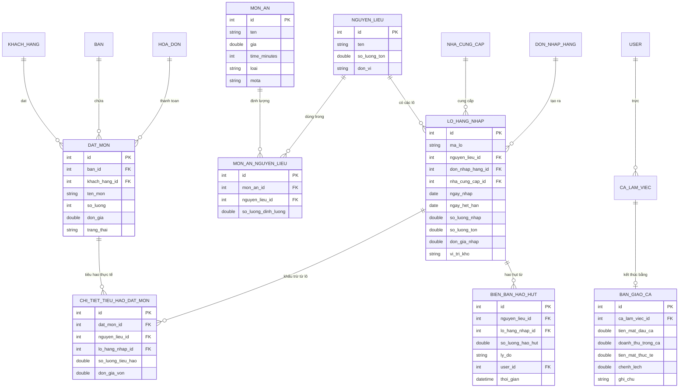
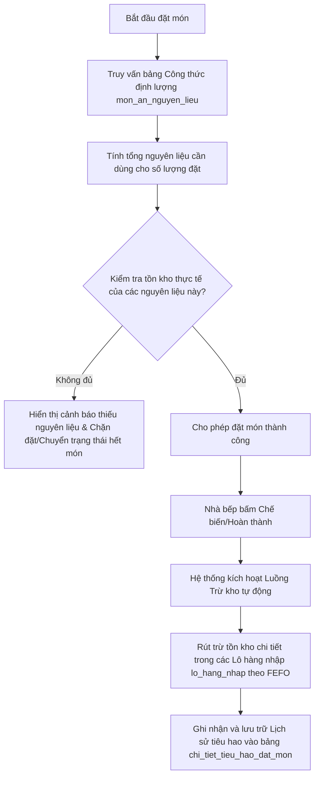

# ĐẶC TẢ YÊU CẦU PHẦN MỀM QUẢN LÝ NHÀ HÀNG & QUÁN ĂN THỰC TẾ
## Hệ thống tối ưu hóa vận hành, quản lý kho & truy xuất nguồn gốc nguyên liệu
**Tác giả:** Antigravity AI & Nhóm Decibel  
**Học kỳ:** Kỳ 3, Năm học 2025 - 2026 (Môn PHP2)  
**Phiên bản:** 2.0 (Bản nâng cấp nghiệp vụ thực tế)

---

## 1. TỔNG QUAN HỆ THỐNG & NHU CẦU THỰC TẾ

Trong vận hành nhà hàng/quán ăn thực tế, một hệ thống quản lý món ăn đơn thuần chỉ dừng lại ở việc tạo đơn và hiển thị hóa đơn là hoàn toàn **chưa đủ**. Các chủ cửa hàng luôn đối mặt với những bài toán đau đầu về **chi phí nguyên liệu** (thường chiếm 30-40% doanh thu), **thất thoát kho**, **an toàn vệ sinh thực phẩm**, và **tối ưu nhân sự**.

Tài liệu này đặc tả bản nâng cấp nghiệp vụ thực tế của **Phần mềm Quản lý Món ăn & Vận hành Nhà hàng**, giải quyết triệt để các bài toán phát sinh trong thực tế bằng cách liên kết chặt chẽ ba trụ cột:
1. **Bán hàng (Đặt món) & Trải nghiệm Khách hàng**
2. **Quản lý kho nguyên liệu theo Lô & Hạn sử dụng (FIFO/FEFO)**
3. **Định lượng công thức món ăn (Recipe Bill of Materials - BOM)**

---

## 2. KIẾN TRÚC CƠ SỞ DỮ LIỆU MỞ RỘNG (DATABSE SCHEMA)

Để thể hiện được toàn bộ mối liên kết động và các phát sinh thực tế, cơ sở dữ liệu của hệ thống được thiết kế mở rộng bao gồm các bảng cốt lõi sau:

### 2.1 Sơ đồ mối quan hệ thực thể (ERD) bằng Mermaid


### 2.2 Các bảng dữ liệu nâng cấp chi tiết

#### 1. Bảng Định lượng món ăn (`mon_an_nguyen_lieu`) - [Bảng trung gian định lượng]
Bảng này thiết lập công thức chế biến (Recipe BOM) cho từng món ăn. Mỗi khi một đĩa món ăn được chế biến, nó sẽ tiêu hao một lượng nguyên liệu chính xác.
* `id` (Primary Key): ID tự tăng.
* `mon_an_id` (Foreign Key -> `mon_an`): ID món ăn.
* `nguyen_lieu_id` (Foreign Key -> `nguyen_lieu`): ID nguyên liệu cần dùng.
* `so_luong_dinh_luong` (Double): Lượng nguyên liệu cần cho **1 đơn vị món ăn** (Ví dụ: Món "Phở Bò" cần `0.15` kg "Thịt bò", `0.2` kg "Bánh phở", `0.5` lít "Nước dùng").

#### 2. Bảng Lô hàng nhập (`lo_hang_nhap`) - [Quản lý nguồn gốc & Date]
Không quản lý nguyên liệu chung chung. Mỗi đợt nhập hàng từ nhà cung cấp sẽ tạo ra một **Lô hàng nhập** riêng biệt để kiểm soát giá vốn, hạn sử dụng và nguồn gốc.
* `id` (Primary Key): ID tự tăng.
* `ma_lo` (String): Mã lô hàng (ví dụ: LOT-BOPHAT-20260525).
* `nguyen_lieu_id` (Foreign Key -> `nguyen_lieu`).
* `don_nhap_hang_id` (Foreign Key -> `don_nhap_hang`): Tham chiếu đơn mua hàng thực tế.
* `nha_cung_cap_id` (Foreign Key -> `nha_cung_cap`): Xác định nguyên liệu này do ai cung cấp.
* `ngay_nhap` (Date): Ngày hàng về kho.
* `ngay_het_han` (Date): **Hạn sử dụng** (Cực kỳ quan trọng để quét cảnh báo cận date).
* `so_luong_nhap` (Double): Số lượng nhập ban đầu.
* `so_luong_ton` (Double): Số lượng còn lại trong lô này (giảm dần khi nấu ăn hoặc hao hụt).
* `don_gia_nhap` (Double): Giá vốn của lô hàng này (dùng để tính toán Giá vốn hàng bán chính xác - COGS).
* `vi_tri_kho` (String): Nơi lưu trữ thực tế (Ví dụ: "Tủ cấp đông 02", "Kệ khô tầng 1").

#### 3. Bảng Biên bản hao hụt / Hủy hàng (`bien_ban_hao_hut`) - [Quản lý rủi ro kho]
Ghi lại toàn bộ nguyên nhân mất mát nguyên liệu ngoài việc phục vụ món (như ôi thiu, chuột cắn, rơi vỡ, hết hạn).
* `id` (Primary Key).
* `nguyen_lieu_id` (Foreign Key).
* `lo_hang_nhap_id` (Foreign Key): Xác định hao hụt từ lô cụ thể nào để giảm tồn kho lô đó.
* `so_luong_hao_hut` (Double).
* `ly_do` (String): "Hết hạn sử dụng", "Sơ chế hỏng", "Rau héo hủy cuối ngày", v.v.
* `user_id` (Foreign Key -> `users`): Nhân viên thực hiện báo cáo hủy.
* `thoi_gian` (DateTime).

#### 4. Bảng Chi tiết tiêu hao đặt món (`chi_tiet_tieu_hao_dat_mon`) - [Lưu vết nguyên liệu đã sử dụng thực tế]
Lưu trữ lịch sử chính xác xem mỗi khi một món ăn được phục vụ, nó đã tiêu hao những nguyên liệu nào, lấy từ lô hàng nào (nhập ngày nào, giá vốn bao nhiêu). Đây chính là bằng chứng pháp lý và dữ liệu kiểm toán tồn kho cực kỳ quan trọng.
* `id` (Primary Key): ID tự tăng.
* `dat_mon_id` (Foreign Key -> `dat_mon`): Liên kết đến món ăn được đặt trong hóa đơn.
* `nguyen_lieu_id` (Foreign Key -> `nguyen_lieu`): Nguyên liệu đã tiêu hao thực tế.
* `lo_hang_nhap_id` (Foreign Key -> `lo_hang_nhap`): **Xác định chính xác nguyên liệu này được rút ra từ Lô hàng nhập nào** (ví dụ: rút từ lô gà ngày 06/04 hay 08/04).
* `so_luong_tieu_hao` (Double): Lượng thực dùng (Ví dụ: 0.15 kg thịt bò).
* `don_gia_von` (Double): Đơn giá vốn của nguyên liệu tại thời điểm xuất kho (được sao chép từ đơn giá nhập của `lo_hang_nhap_id` để cố định giá trị báo cáo tài chính, không sợ bị thay đổi khi lô hàng bị chỉnh sửa sau này).

---

## 3. MỐI LIÊN KẾT PHÁT SINH CỐT LÕI (CORE INTERACTIONS)

### 3.1 Mối liên kết 1: Khi Đặt món -> Hiển thị Nguyên liệu đã tiêu hao & Tự động Trừ kho

#### A. Luồng xử lý khi Đặt món (Order Flow)
Khi khách hàng hoặc nhân viên phục vụ chọn đặt một món ăn (ví dụ: Món **Bò Né** số lượng **2 phần**):



#### B. Cách tính toán chi tiết hiển thị tại màn hình Đặt món (Ví dụ trực quan)
Giả sử định lượng của món **Bò Né** (1 phần):
* **Thịt bò**: 0.15 kg
* **Bơ thực vật**: 0.02 kg
* **Bánh mì**: 1 cái

Khi đặt **2 phần Bò Né**, hệ thống sẽ tự động liên kết và tính toán hiển thị ra bảng:
> **Chi tiết nguyên liệu dự kiến tiêu hao cho đơn hàng:**
> * *Thịt bò*: 0.30 kg (Tồn kho hiện tại: 5.0 kg -> **ĐỦ**)
> * *Bơ thực vật*: 0.04 kg (Tồn kho hiện tại: 1.2 kg -> **ĐỦ**)
> * *Bánh mì*: 2 cái (Tồn kho hiện tại: 1 cái -> ⚠️ **THIẾU 1 CÁI! Cảnh báo không thể chế biến món này**)

#### C. Cơ chế trừ kho động (Inventory Deduction Engine)
Để phản ánh đúng thực tế, hệ thống không chỉ trừ vào cột `so_luong_ton` chung ở bảng `nguyen_lieu`, mà phải đi sâu vào bảng `lo_hang_nhap` để trừ trực tiếp số lượng tồn của từng lô hàng theo nguyên tắc **FEFO (First Expired, First Out - Hàng cận hạn dùng trước)** hoặc **FIFO (First In, First Out - Hàng nhập trước dùng trước)**.

#### D. Cơ chế Lưu trữ lịch sử tiêu hao vào Database (Persistence of Usage History)
Mỗi đĩa món ăn được đặt hàng, khi bếp chế biến và trừ kho thành công, **bắt buộc phải ghi dữ liệu cụ thể vào bảng `chi_tiet_tieu_hao_dat_mon` để lưu vết**.

**Ý nghĩa của việc lưu trữ database:**
* **Bảo toàn dữ liệu giá vốn:** Cho dù các lô hàng trong tương lai bị tiêu hủy hoặc hệ thống kiểm kê lại số lượng, hóa đơn đã bán trong quá khứ vẫn giữ nguyên được giá trị nguyên liệu tiêu hao và giá vốn thực tế tại thời điểm nấu món ăn.
* **Minh bạch hóa đơn bán hàng:** Khi in hóa đơn hoặc khi quản lý kiểm tra, hệ thống có thể truy xuất trực tiếp: *"Món Bò Né của hóa đơn số HD-009 này đã sử dụng chính xác 0.3 kg thịt bò từ Lô nhập PO-20260406 ngày 06/04 với giá vốn là 24,000đ"*.
* **Hỗ trợ truy vết ngộ độc thực phẩm:** Nếu khách hàng báo món ăn bị hỏng gây ngộ độc, quản lý mở hóa đơn ra là biết ngay đĩa ăn đó dùng nguyên liệu lấy từ đơn nhập ngày nào, nhà cung cấp nào để chịu trách nhiệm.

---

### 3.2 Mối liên kết 2: Từ bảng Nguyên liệu -> Truy xuất nguồn gốc "Nguyên liệu ở đâu?"

Trong nhà hàng thực tế, khi thanh tra an toàn thực phẩm kiểm tra hoặc khi xảy ra sự cố (khách hàng ngộ độc, món ăn có mùi lạ), quản lý bắt buộc phải truy xuất được: **Món ăn này dùng nguyên liệu lấy từ đâu?**

#### A. Truy xuất từ bảng Nguyên liệu (`nguyen_lieu`) ra Lô hàng & Nhà cung cấp
Từ giao diện chi tiết của một nguyên liệu (ví dụ: **Thịt thăn bò**), hệ thống sẽ hiển thị bảng cấu trúc nguồn gốc động:

| Mã Lô Hàng | Nhà Cung Cấp | Ngày Nhập | Hạn Sử Dụng | Đơn Giá Nhập | Số Lượng Tồn Trong Lô | Vị Trí Kho | Trạng Thái |
| :--- | :--- | :--- | :--- | :--- | :--- | :--- | :--- |
| **LOT-BOPHAT-2605** | Công ty Thực phẩm Bò Phát | 25/05/2026 | **29/05/2026** | 180,000đ/kg | 4.5 kg | Tủ đông tầng 1 | 🟢 Đang sử dụng |
| **LOT-MEATDELI-2205**| MeatDeli chi nhánh 2 | 22/05/2026 | **26/05/2026** | 195,000đ/kg | 0.5 kg | Tủ đông tầng 2 | 🟡 Cận date (Dùng trước) |

#### B. Truy xuất ngược (Reverse Traceability): Từ đĩa thức ăn trên bàn -> Nguồn gốc Lô hàng
Khi khách hàng gọi món **Bò Né** vào lúc **19h00 ngày 25/05/2026** tại **Bàn số 5**, hệ thống lưu vết giao dịch trừ kho thực tế. Quản lý có thể nhấn vào chi tiết hóa đơn để xem báo cáo truy vết:
> **BÁO CÁO TRUY XUẤT NGUỒN GỐC ĐĨA BÒ NÉ (BÀN 5):**
> * **Thịt bò (0.15 kg):** Xuất từ **Lô LOT-MEATDELI-2205** (Nhập ngày 22/05/2026 từ *MeatDeli*, HSD đến 26/05/2026).
> * **Bơ thực vật (0.02 kg):** Xuất từ **Lô LOT-TUONGAN-1505** (Nhập ngày 15/05/2026 từ *Tổng kho Tường An*).
> * **Bánh mì (1 cái):** Nhập trực tiếp từ *Lò bánh mì Vĩnh Khánh* (Giao tươi mỗi sáng 25/05/2026).

---

### 3.3 Đặc tả Phân tách Nguyên liệu theo Đơn nhập hàng để Kiểm soát Số lượng & Hạn sử dụng (Ví dụ 06/04 & 08/04)

Để giải quyết triệt để yêu cầu kiểm soát thời gian hết hạn và quản lý số lượng nhập, **hệ thống bắt buộc phải phân tách nguyên liệu theo từng Đơn nhập hàng cụ thể**, tuyệt đối không được gộp chung số lượng của các đợt nhập khác nhau.

#### A. Quản lý Độc lập các Đợt nhập (Ví dụ thực tế đợt nhập ngày 06/04 và 08/04)

Giả sử nhà hàng nhập nguyên liệu **"Thịt ức gà"** ở hai đơn hàng khác nhau:
1. **Đơn nhập hàng ngày 06/04 (PO-20260406):**
   * Số lượng nhập: **10 kg**
   * Hạn sử dụng: **12/04/2026**
   * Đơn giá nhập: **80,000đ/kg**
2. **Đơn nhập hàng ngày 08/04 (PO-20260408):**
   * Số lượng nhập: **15 kg**
   * Hạn sử dụng: **14/04/2026**
   * Đơn giá nhập: **85,000đ/kg**

Trong cơ sở dữ liệu và màn hình quản lý kho, nguyên liệu **"Thịt ức gà"** (Tồn tổng: 25 kg) sẽ được phân rã thành **2 dòng tồn kho độc lập** gắn với 2 đơn nhập tương ứng:

| Tên Nguyên Liệu | Mã Đơn Nhập | Ngày Nhập Kho | Hạn Sử Dụng | Số Lượng Nhập | Số Lượng Tồn Hiện Tại | Giá Vốn | Cảnh Báo Hết Hạn |
| :--- | :--- | :--- | :--- | :--- | :--- | :--- | :--- |
| Thịt ức gà | **PO-20260406** | 06/04/2026 | **12/04/2026** | 10 kg | **10.0 kg** | 80,000đ | Hạn dùng còn 6 ngày (Ưu tiên bán) |
| Thịt ức gà | **PO-20260408** | 08/04/2026 | **14/04/2026** | 15 kg | **15.0 kg** | 85,000đ | Hạn dùng còn 8 ngày (Lưu kho) |

#### B. Cơ chế Trừ kho và Ghi nhận Ngày sử dụng thực tế

Khi có khách hàng đặt món **"Ức gà áp chảo"** (mỗi đĩa định lượng **0.25 kg** Thịt ức gà):

1. **Ngày 07/04/2026 (Khách gọi 8 đĩa - tổng dùng 2.0 kg):**
   * Hệ thống xác định đợt hàng PO-20260406 (nhập 06/04) có hạn sử dụng ngắn hơn (12/04) so với đợt PO-20260408 (chưa nhập hoặc hạn dài hơn).
   * Hệ thống tự động trừ **2.0 kg** vào tồn kho của **Đơn nhập 06/04**.
   * Số lượng tồn của Đơn nhập 06/04 giảm từ **10.0 kg** xuống **8.0 kg**. Đơn nhập 08/04 giữ nguyên **15.0 kg**.
   * Hệ thống ghi nhận nhật ký xuất kho: *"Xuất 2.0 kg gà chế biến cho Bàn X - Nguồn gốc: Đơn nhập PO-20260406 ngày 06/04"*.

2. **Ngày 09/04/2026 (Khách gọi thêm 32 đĩa - tổng dùng 8.0 kg):**
   * Hệ thống tiếp tục quét lô cận date nhất: Lô PO-20260406 (còn tồn 8.0 kg).
   * Lúc này lượng cần dùng là 8.0 kg vừa khít với lượng tồn còn lại của đơn nhập ngày 06/04.
   * Hệ thống trừ toàn bộ **8.0 kg** của đơn nhập 06/04 (Đơn 06/04 chính thức hết hàng tồn, tồn = 0 kg).
   * Hệ thống ghi nhận nhật ký xuất kho: *"Xuất 8.0 kg gà chế biến - Nguồn gốc: Đơn nhập PO-20260406 ngày 06/04 (Đã tiêu thụ hết đơn hàng này)"*.

3. **Ngày 10/04/2026 (Khách gọi tiếp 4 đĩa - tổng dùng 1.0 kg):**
   * Hệ thống kiểm tra: Đơn nhập 06/04 đã hết hàng (tồn = 0 kg).
   * Hệ thống tự động chuyển sang trừ vào **Đơn nhập ngày 08/04** (PO-20260408).
   * Số lượng tồn của Đơn nhập 08/04 giảm từ **15.0 kg** xuống **14.0 kg**.
   * Nhật ký xuất kho ghi nhận rõ: *"Xuất 1.0 kg gà chế biến - Nguồn gốc: Đơn nhập PO-20260408 ngày 08/04"*.

#### C. Lợi ích Thực tiễn của việc Phân tách theo Đơn Nhập
* **Kiểm soát tuyệt đối Hạn sử dụng (Date):** Ngăn chặn việc trộn lẫn hàng cũ và hàng mới, tránh tình trạng hàng cũ nằm sâu dưới đáy tủ đông bị hết hạn, trong khi hàng mới nhập về lại được lôi ra sử dụng trước.
* **Đối chiếu số lượng nhập và hao hụt chính xác:** Giúp quản lý biết chính xác đơn nhập ngày 06/04 nhập về 10kg thì thực tế bán được bao nhiêu kg cho khách, bị hao hụt bao nhiêu kg, từ đó đánh giá được chất lượng hàng của nhà cung cấp đó (ví dụ hàng ngày 06/04 bị hao hụt nhiều do nước/đông đá nhiều hơn ngày 08/04).
* **Đánh giá hiệu quả mua hàng:** Nếu đơn nhập ngày 06/04 có hạn sử dụng ngắn mà bán không kịp, dẫn đến phải hủy bỏ 2kg cuối ngày, quản lý sẽ lập tức nhận được báo cáo để điều chỉnh giảm số lượng đặt hàng ở các đợt tiếp theo, tránh lãng phí vốn lưu động.

---

## 4. CÁC TÌNH HUỐNG PHÁT SINH THỰC TẾ KHI VẬN HÀNH QUÁN ĂN (USE CASES)

Dưới đây là đặc tả chi tiết 6 tình huống phát sinh thường xuyên nhất tại các nhà hàng thực tế mà phần mềm phải xử lý trơn tru:

### Tình huống 1: Hao hụt tự nhiên & Hủy nguyên liệu hỏng (Natural Spoilage & Food Waste)
* **Thực tế:** Rau củ quả để qua ngày bị héo úa phải bỏ, thịt cấp đông bị cháy lạnh, sữa hết hạn sử dụng. Trực giác quản lý yêu cầu phải ghi nhận tổn thất này chứ không được để kho tự động giảm mà không rõ lý do.
* **Cách phần mềm xử lý:** 
  * Cung cấp chức năng **Báo cáo hủy/hao hụt nguyên liệu** dành cho Thủ kho/Bếp trưởng.
  * Khi tạo biên bản hủy, nhân viên chọn nguyên liệu, chọn chính xác **Lô hàng nhập** đang bị hỏng (để hệ thống giảm trừ tồn kho của lô đó), nhập số lượng hủy và lý do hủy (hết hạn, dập nát, chuột bọ).
  * Hệ thống tự động hạch toán chi phí hủy này vào mục **Chi phí vận hành / Hao hụt kho** trong báo cáo tài chính thay vì tính vào Giá vốn hàng bán (COGS) của món ăn (giúp báo cáo tài chính không bị sai lệch tỷ lệ lãi gộp).

### Tình huống 2: Chênh lệch Kiểm kê Kho định kỳ (Inventory Audit & Reconciliation)
* **Thực tế:** Trên phần mềm báo cáo tồn kho thịt bò là **5.2 kg**, nhưng khi bếp trưởng dùng cân thực tế cuối ngày chỉ còn **4.8 kg** (do hao hụt trong lúc thái lát thịt, hoặc do đầu bếp múc định lượng quá tay cho khách). Sự chênh lệch này là không thể tránh khỏi.
* **Cách phần mềm xử lý:**
  * Tính năng **Kiểm kê kho** định kỳ (hàng ngày hoặc hàng tuần).
  * Nhân viên kho tạo phiếu kiểm kê, nhập **Số lượng thực tế** đếm/cân được.
  * Hệ thống tự tính toán **Chênh lệch** (`Tồn thực tế - Tồn hệ thống`).
  * Khi quản lý bấm **Phê duyệt phiếu kiểm kê**:
    1. Hệ thống tự động cập nhật `so_luong_ton` trong DB về con số thực tế.
    2. Ghi nhận nhật ký chênh lệch kho để quản lý giám sát tỷ lệ thất thoát. Nếu tỷ lệ thất thoát vượt quá mức cho phép (ví dụ: > 2% tổng lượng dùng), hệ thống sẽ gửi cảnh báo đỏ để quản lý kiểm tra camera hoặc quy trình của bếp.

### Tình huống 3: Hủy món / Thay đổi món ăn khi đang chế biến (Order Cancellation & Dish Refunds)
* **Thực tế:** Khách đặt món **Mực nướng**, nhưng sau 15 phút đợi lâu quá chưa thấy lên món nên khách yêu cầu hủy món. Lúc này xảy ra hai trường hợp tại bếp:
  * *Trường hợp A:* Món ăn **chưa được chế biến** (Bếp chưa làm gì).
  * *Trường hợp B:* Bếp **đã nướng xong hoặc đang nướng dở** đĩa mực đó.
* **Cách phần mềm xử lý:**
  * Khi nhân viên phục vụ bấm "Yêu cầu hủy món" trên hệ thống, màn hình bếp sẽ hiện thông báo xác nhận:
  * **Nếu Bếp xác nhận "Chưa chế biến":** Đơn hàng hủy thành công. Hệ thống **không** thực hiện trừ kho nguyên liệu (hoặc hoàn trả lại nguyên liệu nếu hệ thống áp dụng cơ chế trừ kho ngay từ lúc đặt).
  * **Nếu Bếp xác nhận "Đang làm/Đã làm xong":** Hệ thống ghi nhận trạng thái hủy món nhưng gắn nhãn **"Hủy phát sinh hao hụt bếp"**. 
    * Khách hàng không phải trả tiền món này (giảm trừ trên hóa đơn).
    * Nguyên liệu mực (ví dụ: 0.3 kg mực tươi) vẫn bị trừ khỏi kho hệ thống và được tự động đẩy vào **Báo cáo hao hụt chế biến của bếp** để tính vào chi phí hao hụt vận hành của nhà hàng.

### Tình huống 4: Tách, gộp hóa đơn và chuyển bàn (Table Transfers & Splitting/Merging)
* **Thực tế:** Một nhóm khách ngồi Bàn 3 nhưng sau đó thấy view đẹp hơn ở Bàn 9 nên muốn chuyển toàn bộ món sang Bàn 9. Hoặc hai nhóm đi chung lúc đầu ngồi riêng Bàn 1 & Bàn 2, sau đó muốn gộp lại thành một hóa đơn ngồi chung bàn lớn. Hoặc một bàn 6 người ăn xong nhưng muốn chia làm 3 hóa đơn riêng lẻ để tự thanh toán tiền của mình.
* **Cách phần mềm xử lý:**
  * **Chuyển bàn:** Hệ thống cho phép chọn Bàn nguồn và Bàn đích, chuyển toàn bộ các món `dang_cho`, `dang_lam`, `da_giao` sang bàn mới, giải phóng trạng thái bàn cũ thành "Bàn trống".
  * **Gộp bàn/Gộp hóa đơn:** Cho phép chọn nhiều bàn đang hoạt động và gộp tất cả danh sách món đặt vào một bàn duy nhất, dồn toàn bộ hóa đơn về bàn đích.
  * **Tách hóa đơn:** Cho phép nhân viên chọn các món cụ thể trong danh sách đã dùng (hoặc chia nhỏ số lượng của một món, ví dụ bàn gọi 6 chai bia, tách 3 chai sang hóa đơn mới) để tạo ra các hóa đơn thanh toán riêng biệt một cách nhanh chóng.

### Tình huống 5: Kết ca và đối chiếu bàn giao két tiền (Shift Closure & Fund Reconciliation)
* **Thực tế:** Thu ngân ca sáng kết thúc ca làm việc lúc 14h00 và bàn giao két tiền mặt cho thu ngân ca chiều. Nếu không bàn giao chặt chẽ, cuối tháng rất dễ xảy ra tình trạng mất tiền mặt không rõ lý do.
* **Cách phần mềm xử lý:**
  * Mỗi ca làm việc của một nhân viên thu ngân được quản lý bằng một **Phiên làm việc (Shift)**.
  * Đầu ca: Nhân viên nhập số **Tiền mặt ban đầu trong két** (tiền lẻ thối cho khách - ví dụ: 2,000,000đ).
  * Trong ca: Hệ thống ghi nhận toàn bộ các giao dịch phát sinh bằng tiền mặt, thẻ ngân hàng, ví điện tử.
  * Cuối ca: Hệ thống tự tính toán **Tiền mặt lý thuyết phải có** trong két:
    $$\text{Tiền mặt lý thuyết} = \text{Tiền mặt ban đầu} + \text{Doanh thu tiền mặt trong ca} - \text{Tiền mặt đã chi ra từ két (nếu có)}$$
  * Thu ngân bắt buộc phải đếm tiền mặt thực tế trong két và nhập con số **Tiền mặt thực tế đếm được**.
  * Hệ thống đối chiếu và tính ra **Chênh lệch quỹ** (nếu chênh lệch khác 0, thu ngân phải nhập giải trình lý do trước khi bấm Kết ca bàn giao két tiền). Mọi biên bản kết ca chênh lệch đều được gửi trực tiếp đến tài khoản Admin của quản lý.

### Tình huống 6: Tích lũy điểm khách hàng và chính sách ưu đãi thành viên (Loyalty Points)
* **Thực tế:** Để giữ chân khách quen, nhà hàng cần tích lũy điểm khi ăn (ví dụ: hóa đơn 100,000đ được tích 5 điểm tương đương 5,000đ). Lần sau khách đến có thể dùng điểm này để giảm trừ trực tiếp vào hóa đơn mới.
* **Cách phần mềm xử lý:**
  * Mỗi khách hàng có một tài khoản thành viên lưu trữ số điện thoại và **Số dư điểm tích lũy**.
  * Khi thanh toán hóa đơn:
    * Hệ thống kiểm tra số điện thoại khách hàng, tự động cộng điểm tích lũy dựa trên tỷ lệ cấu hình (ví dụ: cộng 5% giá trị hóa đơn thực thanh toán thành điểm tích lũy).
    * Hỗ trợ chức năng **Tiêu điểm**: Khách hàng được quyền chọn quy đổi số điểm tích lũy hiện có thành tiền giảm giá trực tiếp cho hóa đơn hiện tại (1 điểm = 1,000đ).
    * Ghi nhận lịch sử giao dịch điểm (`giao_dich_diem`) rõ ràng để tránh gian lận điểm từ nhân viên thu ngân.

---

## 5. TỔNG KẾT LUỒNG VẬN HÀNH PHẦN MỀM THỰC TẾ (WORKFLOW)

Dưới đây là mô hình trực quan mô tả luồng đi của nguyên liệu từ khi nhập kho cho đến khi thành món ăn trên bàn khách và báo cáo tài chính:

```
[Nhà cung cấp] 
      │
      ▼ (Kiểm kê thực nhận)
[Đơn nhập hàng] ──► Tạo ra [Lô hàng nhập] (Lưu Hạn sử dụng, Giá vốn, Vị trí kho)
                                 │
                                 ▼ (Định lượng công thức / Recipe BOM)
[Khách đặt món] ──► Trừ kho theo Lô (FEFO - Cận hạn dùng trước) ──► Chế biến món ăn
                                 │
                                 ├──► Hủy món dở dang ──► Đẩy vào [Hao hụt bếp]
                                 │
                                 └──► Khách ăn xong ──► Thanh toán & Tích điểm thành viên
```

Bản đặc tả nâng cấp này đảm bảo phần mềm quản lý món ăn không chỉ là một công cụ bán hàng đơn giản, mà trở thành một **hệ thống ERP thu nhỏ** chuyên biệt cho ngành F&B, giúp nhà hàng vận hành khoa học, chống thất thoát tuyệt đối và bảo đảm an toàn vệ sinh thực phẩm tối đa.
