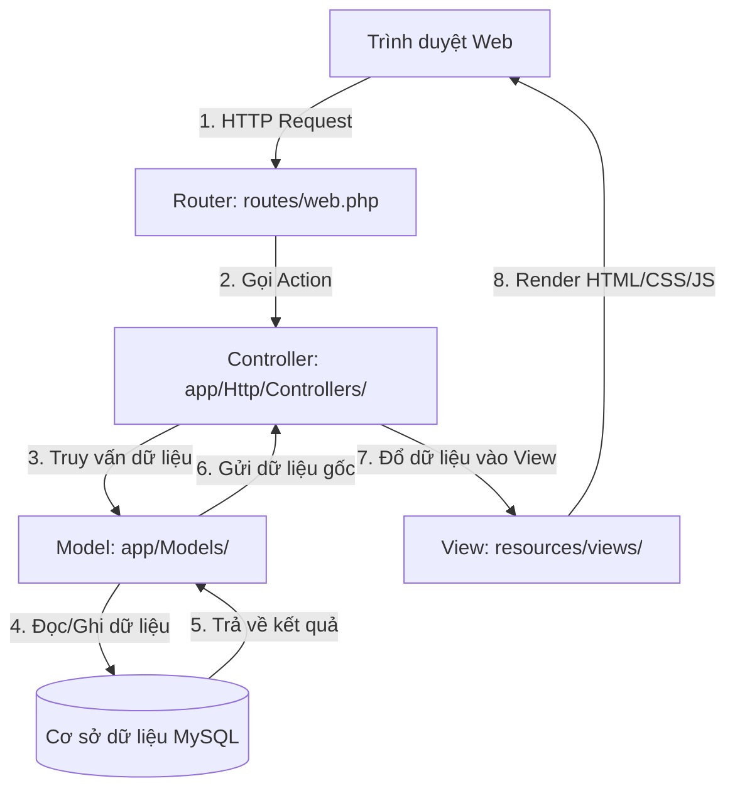

# CẨM NANG KIẾN TRÚC HỆ THỐNG - DỰ ÁN QUẢN LÝ ẨM THỰC M&S

Tài liệu này được biên soạn dành riêng cho người mới học để giải thích cấu trúc mã nguồn, cơ chế hoạt động của mô hình MVC trong Laravel, thiết kế Cơ sở dữ liệu và các thuật toán nâng cao trong dự án **PhanMemQuanLyMonAn**.

---

## 1. Mô hình MVC (Model - View - Controller) trong Laravel

Mô hình MVC phân chia ứng dụng thành 3 thành phần chính để dễ quản lý, mở rộng và bảo trì:



### Chi tiết luồng xử lý:
1. **Định tuyến (Router - `routes/web.php`):** Khi người dùng truy cập một đường dẫn URL (ví dụ: `http://PhanMemQuanLyMonAn.test/ban`), Router sẽ nhận diện URL này và gọi tới Hàm (Action) tương ứng trong Controller (ở đây là hàm `index` của `BanController`).
2. **Bộ điều khiển (Controller - `app/Http/Controllers/`):** Nơi chứa toàn bộ logic nghiệp vụ (Tính toán doanh số, gọi lệnh sao lưu, phân phối dữ liệu). Controller sẽ gửi yêu cầu lấy dữ liệu tới Model.
3. **Mẫu dữ liệu (Model - `app/Models/`):** Đại diện cho các bảng dữ liệu trong CSDL MySQL. Model sử dụng công cụ **Eloquent ORM** của Laravel để truy vấn dữ liệu bằng các câu lệnh PHP đơn giản thay vì phải viết các câu lệnh SQL dài dòng.
4. **Giao diện (View - `resources/views/`):** Chứa mã HTML/CSS kết hợp với công cụ biên dịch **Blade** của Laravel. View nhận dữ liệu sạch từ Controller truyền qua và render thành trang web hoàn chỉnh gửi về trình duyệt của khách.

---

## 2. Thiết kế Cơ sở Dữ liệu & Các Mối liên kết (Database Schema)

Hệ thống quản lý nhà hàng bao gồm các bảng chính sau:

| Tên Bảng CSDL | Model tương ứng | Vai trò trong hệ thống |
| :--- | :--- | :--- |
| `users` | `User` | Lưu tài khoản đăng nhập (Admin, Nhân viên, Nhà bếp). |
| `ban` | `Ban` | Quản lý các bàn ăn, số lượng khách tại bàn và yêu cầu thanh toán. |
| `mon_an` | `MonAn` | Thực đơn cố định của nhà hàng (Tên món, Giá bán, Mô tả). |
| `dat_mon` | `DatMon` | Nhật ký gọi món động (Món nào, Bàn nào đặt, Số lượng, Giá lúc đặt). |
| `nguyen_lieu` | `NguyenLieu` | Kho nguyên liệu tổng (Tên nguyên liệu, Tổng lượng tồn kho, Đơn vị). |
| `lo_hang_nhap` | `LoHangNhap` | Lô hàng nhập khẩu chi tiết (Đơn giá nhập, Số lượng tồn của lô, Hạn sử dụng). |
| `chi_tiet_tieu_hao_dat_mon` | `ChiTietTieuHaoDatMon` | Nhật ký khấu hao kho (Món ăn tiêu hao bao nhiêu nguyên liệu, thuộc lô hàng nào). |
| `khach_hang` | `KhachHang` | Thông tin khách hàng thành viên CRM để tích điểm (Tên, SĐT, Điểm). |

### Các mối quan hệ cốt lõi trong Eloquent ORM:

* **Sự khác biệt giữa `MonAn` và `DatMon` (Điểm cực kỳ dễ nhầm lẫn):**
  * `MonAn` là món ăn khai báo trong thực đơn (Menu). Nó cố định và không chứa thông tin bàn ăn hay thời gian gọi.
  * `DatMon` là một đĩa ăn cụ thể được khách tại bàn gọi. Mỗi lần khách bấm nút đặt 1 đĩa Phở, hệ thống tạo 1 dòng `DatMon` liên kết với bàn ăn thông qua `ban_id`.
* **Quan hệ Nhiều-Nhiều (Many-to-Many) giữa `MonAn` và `NguyenLieu`:**
  * Một món ăn được chế biến từ nhiều nguyên liệu (BOM - Bill of Materials).
  * Một nguyên liệu lại dùng cho nhiều món khác nhau.
  * Liên kết này được thực hiện qua bảng trung gian `mon_an_nguyen_lieu` kèm cột `so_luong_dinh_luong` để lưu định lượng cụ thể.

---

## 3. Giải thích chi tiết các thuật toán nâng cao

### A. Thuật toán trừ kho cận hạn trước - FEFO (First Expired, First Out)
Trong quản lý thực phẩm, nguyên liệu nhập trước có thể hết hạn sau. Do đó, hệ thống không dùng FIFO (nhập trước xuất trước) mà dùng **FEFO (cận date dùng trước)** để giảm thiểu tối đa hư hỏng nguyên liệu.

#### Cách thức hoạt động của code:
1. Khi bếp chuyển trạng thái món sang **Đang nấu (dang_lam)**, hàm `khauTruKhoFEFO` trong `DatMonController` được kích hoạt.
2. Hệ thống kiểm tra công thức định lượng (BOM) của món ăn. Ví dụ: Món *Phở bò* cần *0.1 kg thịt bò*.
3. Hệ thống chạy truy vấn tìm tất cả các lô hàng bò nhập khẩu trong bảng `lo_hang_nhap` còn tồn kho (`so_luong_ton > 0`) và sắp xếp theo **Hạn sử dụng tăng dần** (`orderBy('ngay_het_han', 'asc')`).
4. Hệ thống duyệt từng lô hàng để khấu trừ dần:
   * Nếu lô hàng A cận hạn nhất có tồn kho nhiều hơn lượng cần dùng -> Trừ trực tiếp vào lô A và dừng lại.
   * Nếu lô hàng A không đủ -> Trừ sạch lô A về 0, rồi chuyển sang trừ tiếp vào lô B tiếp theo.
5. Toàn bộ quy trình được bao bọc trong **Database Transaction** (`DB::transaction`). Nếu giữa chừng một loại gia vị/nguyên liệu nào đó bị thiếu hụt, hệ thống sẽ thực hiện **Rollback** (Hủy bỏ mọi thay đổi đã thực hiện trước đó) và báo lỗi cho đầu bếp, đảm bảo số liệu kho không bị sai lệch.

---

### B. Thuật toán ước tính thời gian chờ thực tế (Kitchen Job Scheduling)
Khách hàng luôn muốn biết món ăn của mình cần đợi bao lâu. Tuy nhiên, thời gian chờ không đơn thuần bằng tổng thời gian nấu các món, mà phụ thuộc vào số lượng đầu bếp trực ca đang làm việc đồng thời.

#### Mô hình lập lịch trong `DatMonController::tinhThoiGianChoUocTinh`:
* Hệ thống khởi tạo một mảng biểu diễn dòng thời gian của các đầu bếp. Ví dụ có 3 đầu bếp trực ca: `[Chef 1: 0 phút, Chef 2: 0 phút, Chef 3: 0 phút]`.
* Duyệt qua danh sách món ăn đang xếp hàng chế biến theo thứ tự ưu tiên:
  1. Tìm đầu bếp rảnh rỗi sớm nhất (người có số phút bận nhỏ nhất hiện tại).
  2. Phân phối món ăn cho đầu bếp đó chế biến.
  3. Cập nhật thời điểm rảnh rỗi tiếp theo của đầu bếp đó bằng: `Thời điểm rảnh hiện tại + (Thời gian nấu món * Số lượng suất gọi)`.
  4. Lưu thời điểm hoàn thành đó làm Thời gian chờ ước tính của món ăn.
* Kết quả là khách hàng sẽ nhận được con số ước lượng chính xác thời gian món ăn được mang lên dựa trên khối lượng công việc thực tế của bếp.

---

### C. Đồng bộ thời gian thực WebSockets & Âm thanh KDS
Hệ thống sử dụng công nghệ WebSockets để kết nối không gián đoạn giữa trình duyệt của khách hàng, nhân viên thu ngân và nhà bếp:

```
[Khách gọi món] ---> (Gửi HTTP POST) ---> [Laravel Server] 
                                                |
                                      (Kích hoạt Event)
                                                |
                                                v
[Bếp KDS nhận món] <--- (WebSockets) <--- [Laravel Reverb]
(Phát nhạc chuông JS)
```

1. **Broadcast Event:** Khi có sự thay đổi trạng thái đơn hoặc bàn ăn, Laravel kích hoạt một Event (ví dụ: `OrderStatusUpdated`). Sự kiện này tự động đẩy dữ liệu qua giao thức WebSockets nhờ máy chủ **Laravel Reverb**.
2. **Echo Client:** Trình duyệt phía Bếp sử dụng thư viện **Laravel Echo** để liên tục lắng nghe kênh truyền dẫn. Ngay khi có đơn mới, Echo bắt được sự kiện và tự động tải lại lưới HTML qua AJAX mà không cần tải lại toàn bộ trang (F5).
3. **Tổng hợp âm thanh Web Audio API (`AudioContext`):** 
   Thay vì tải một file nhạc chuông định dạng `.mp3` nặng nề từ máy chủ dễ bị trễ hoặc lỗi kết nối, giao diện bếp sử dụng công nghệ tổng hợp tần số trực tiếp bằng code Javascript:
   * Khởi tạo một `AudioContext` của trình duyệt.
   * Tạo bộ dao động `OscillatorNode` phát ra tần số sóng hình sin tương tự tiếng chuông cơ học (Nốt Mi5 - 659.25Hz và Đô5 - 523.25Hz).
   * Dùng bộ chỉnh âm lượng `GainNode` để nhỏ tiếng dần theo hàm mũ giúp âm thanh êm tai.

---

## 4. Hướng dẫn thiết lập chạy thử dự án nhanh chóng

1. **Khởi động Laragon / XAMPP:** Đảm bảo dịch vụ Apache và MySQL server đang chạy bình thường.
2. **Cấu hình CSDL (.env):** 
   * Tạo một database mới tên là `phan_mem_quan_ly_mon_an` trong phpMyAdmin hoặc HeidiSQL.
   * Copy tệp `.env.example` thành `.env` và kiểm tra cấu hình kết nối DB:
     ```env
     DB_CONNECTION=mysql
     DB_HOST=127.0.0.1
     DB_PORT=3306
     DB_DATABASE=phan_mem_quan_ly_mon_an
     DB_USERNAME=root
     DB_PASSWORD=
     ```
3. **Cài đặt thư viện dependencies:** Chạy các lệnh sau trong thư mục dự án:
   ```bash
   composer install
   npm install
   ```
4. **Khởi tạo dữ liệu mẫu (Seed):** Chạy lệnh tạo bảng và tự động thêm các tài khoản, bàn ăn và món ăn mẫu để test:
   ```bash
   php artisan migrate:fresh --seed
   ```
   *Tài khoản Admin mẫu để đăng nhập:* `admin@gmail.com` / Mật khẩu: `password123`
5. **Chạy các máy chủ:**
   * Chạy server Web Laravel: `php artisan serve` hoặc truy cập qua tên miền ảo của Laragon `http://PhanMemQuanLyMonAn.test`.
   * Chạy máy chủ WebSockets:
     ```bash
     php artisan reverb:start
     ```
