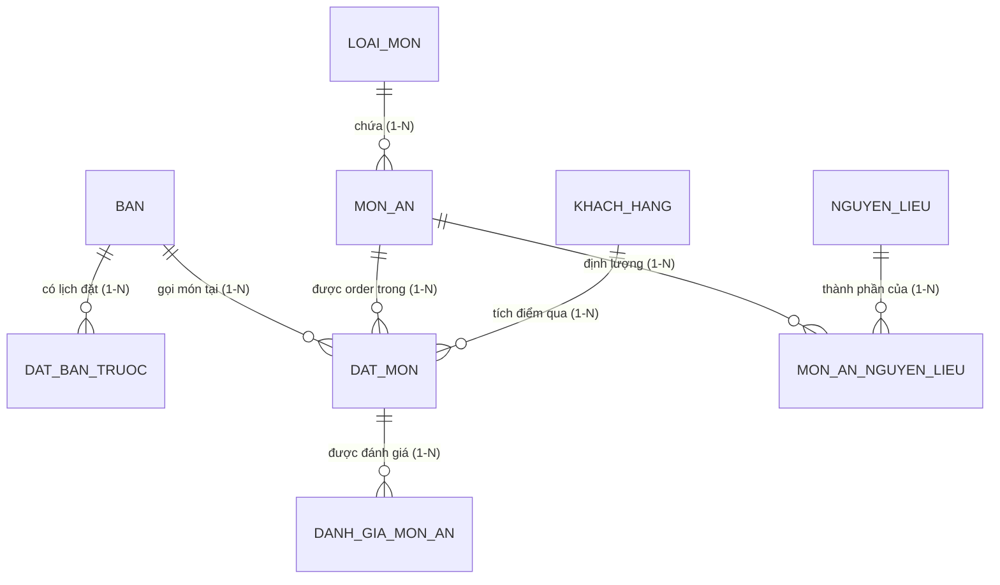

# BÁO CÁO THIẾT KẾ VÀ CÀI ĐẶT CƠ SỞ DỮ LIỆU
**MÔN HỌC:** HỆ QUẢN TRỊ CƠ SỞ DỮ LIỆU  
**ĐỀ TÀI:** THIẾT KẾ VÀ CÀI ĐẶT CƠ SỞ DỮ LIỆU HỆ THỐNG QUẢN LÝ NHÀ HÀNG & GỌI MÓN (RESTAURANT MANAGEMENT SYSTEM)  
**NHÓM THỰC HIỆN:** NHÓM 5  
**TRƯỞNG NHÓM:** NGUYỄN NGỌC HÀ THẢO  
**HỆ THỐNG ÁP DỤNG:** Website Quản lý Nhà hàng & Gọi món (`PhanMemQuanLyMonAn`)  

---

## PHẦN 2. THIẾT KẾ HỆ THỐNG

### 2.1 Lược đồ quan hệ Cơ sở Dữ liệu

Hệ thống Quản lý Nhà hàng và Gọi món được thiết kế bao gồm 12 bảng dữ liệu chặt chẽ, đáp ứng đầy đủ các phân hệ nghiệp vụ từ quản trị danh mục thực đơn, sơ đồ bàn, đặt bàn trước, quản lý kho & định lượng (BOM), đến nghiệp vụ order món tại bàn, đánh giá chất lượng và báo cáo doanh thu.

#### 2.1.1 Biểu diễn các bảng dữ liệu dưới dạng dòng (Relational Schema in textual format)
> **Quy ước ký hiệu:**
> - Khóa chính (Primary Key) được **in đậm và gạch chân**: <ins>**MãKhóaChính**</ins>
> - Khóa ngoại (Foreign Key) có tiền tố dấu thăng: **#MãKhóaNgoại**

1. **LOAI_MON** (<ins>**id**</ins>, ma_loai, ten_loai, created_at, updated_at)
2. **MON_AN** (<ins>**id**</ins>, **#loai_mon_id**, ten_mon, gia, mo_ta, hinh_anh, trang_thai, created_at, updated_at)
3. **BAN** (<ins>**id**</ins>, so_ban, suc_chua, trang_thai, khu_vuc, yeu_cau_thanh_toan, so_luong_khach, created_at, updated_at)
4. **DAT_BAN_TRUOC** (<ins>**id**</ins>, **#ban_id**, ma_reservation, ten_khach, sdt, thoi_gian_hen, so_luong_khach, tien_coc, trang_thai, ghi_chu, created_at, updated_at)
5. **KHACH_HANG** (<ins>**id**</ins>, ho_ten, so_dien_thoai, email, diem_tich_luy, hang_thanh_vien, tong_chi_tieu, created_at, updated_at)
6. **USERS** (<ins>**id**</ins>, name, email, password, role, so_dien_thoai, trang_thai, created_at, updated_at)
7. **NGUYEN_LIEU** (<ins>**id**</ins>, ten_nguyen_lieu, don_vi_tinh, so_luong_ton, gia_nhap_trung_binh, dinh_muc_toi_thieu, han_su_dung, created_at, updated_at)
8. **MON_AN_NGUYEN_LIEU** (<ins>**id**</ins>, **#mon_an_id**, **#nguyen_lieu_id**, so_luong_can, don_vi_tinh, created_at, updated_at)
9. **NHA_CUNG_CAP** (<ins>**id**</ins>, ma_ncc, ten_ncc, so_dien_thoai, email, dia_chi, danh_gia_sao, created_at, updated_at)
10. **DAT_MON** (<ins>**id**</ins>, **#ban_id**, **#mon_an_id**, **#khach_hang_id**, so_luong, don_gia, tong_tien, options_json, ghi_chu, trang_thai, phuong_thuc_thanh_toan, session_token, thu_tu_uu_tien, so_luong_khach, created_at, updated_at) *(Bảng nghiệp vụ trọng tâm > 1.200 records)*
11. **DANH_GIA_MON_AN** (<ins>**id**</ins>, **#dat_mon_id**, **#ban_id**, so_sao, noi_dung_danh_gia, canh_bao_do, created_at, updated_at)
12. **BAO_CAO_QUAN_LY** (<ins>**id**</ins>, ma_bao_cao, ngay_lap, nguoi_lap, ca_lam_viec, tong_so_hoa_don, tong_luong_khach, tong_doanh_thu, doanh_thu_tien_mat, doanh_thu_chuyen_khoan, created_at, updated_at)

---

#### 2.1.2 Phân tích chi tiết các mối quan hệ (Cardinality / Relationships)



| Bảng Nguồn (1) | Bảng Đích (N) | Khóa Ngoại (#FK) | Bản Số | Ý Nghĩa Nghiệp Vụ Thực Tế |
| :--- | :--- | :--- | :---: | :--- |
| **LOAI_MON** | **MON_AN** | `#loai_mon_id` | 1 - N | Một danh mục (Khai vị, Món chính, Hải sản,...) chứa nhiều món ăn. Khi xóa danh mục, khóa ngoại được gán `NULL` để không làm mất thực đơn. |
| **BAN** | **DAT_BAN_TRUOC** | `#ban_id` | 1 - N | Một bàn ăn có thể được đặt trước vào nhiều khung giờ khác nhau. Bàn được liên kết để giữ chỗ trước khi khách đến. |
| **BAN** | **DAT_MON** | `#ban_id` | 1 - N | Một bàn ăn phát sinh nhiều lượt gọi món trong các phiên phục vụ (Session). Khi xóa bàn, các lượt gọi món liên quan bị xóa thác (CASCADE). |
| **MON_AN** | **DAT_MON** | `#mon_an_id` | 1 - N | Mỗi món ăn trong thực đơn xuất hiện trong nhiều lượt gọi món và hóa đơn của khách. |
| **KHACH_HANG** | **DAT_MON** | `#khach_hang_id` | 1 - N | Khách hàng thân thiết tích lũy điểm thưởng và nâng hạng VIP (Đồng, Bạc, Vàng, Kim Cương) qua mỗi lần gọi món. |
| **MON_AN** | **MON_AN_NGUYEN_LIEU** | `#mon_an_id` | 1 - N | Mối quan hệ N - N giữa Món ăn và Nguyên liệu được giải quyết thông qua bảng Định lượng (BOM - Bill of Materials). |
| **NGUYEN_LIEU** | **MON_AN_NGUYEN_LIEU** | `#nguyen_lieu_id` | 1 - N | Một nguyên liệu trong kho (Thịt bò Wagyu, Tôm sú, Phô mai,...) là thành phần chế biến của nhiều món ăn khác nhau. |
| **DAT_MON** | **DANH_GIA_MON_AN** | `#dat_mon_id` | 1 - 1 / 1 - N | Mỗi món ăn sau khi phục vụ có thể được khách hàng đánh giá mức độ hài lòng (từ 1 đến 5 sao) và để lại nhận xét. |

---

### 2.2 Thiết kế Cơ sở Dữ liệu (Database Design & Implementation)

#### 2.2.1 Tổ chức và lưu trữ dữ liệu của hệ thống
- **Hệ Quản trị CSDL:** MySQL 8.0+ / MariaDB 10.4+.
- **Storage Engine:** `InnoDB`.
  - Hỗ trợ đầy đủ các tính chất **ACID (Atomicity, Consistency, Isolation, Durability)** của giao dịch.
  - Sử dụng cơ chế **Khóa mức dòng (Row-level Locking)** và Multi-Version Concurrency Control (MVCC) giúp phục vụ hàng trăm khách gọi món và thanh toán đồng thời mà không bị tắc nghẽn (Table Lock).
  - Đảm bảo toàn vẹn tham chiếu thông qua **Foreign Key Constraints** với các quy tắc `ON DELETE CASCADE` và `ON DELETE SET NULL`.
- **Chuẩn mã hóa & Đối chiếu (Charset & Collation):** `utf8mb4` / `utf8mb4_unicode_ci`.
  - Lưu trữ tiếng Việt có dấu chuẩn xác 100%, hỗ trợ ký tự đặc biệt và biểu tượng icon/emoji của món ăn.

---

#### 2.2.2 Từ điển dữ liệu chi tiết (Data Dictionary)

##### 1. Bảng `loai_mon` (Danh mục loại món ăn)
| Tên Cột | Kiểu Dữ Liệu | Ràng Buộc | Diễn Giải Nghiệp Vụ |
| :--- | :--- | :--- | :--- |
| `id` | BIGINT UNSIGNED | PK, AUTO_INCREMENT | Mã định danh duy nhất của loại món |
| `ma_loai` | VARCHAR(20) | NOT NULL, UNIQUE | Mã loại viết tắt (ví dụ: `KHAI_VI`, `MON_CHINH`, `HAI_SAN`) |
| `ten_loai` | VARCHAR(100) | NOT NULL | Tên hiển thị danh mục món ăn |
| `created_at` | TIMESTAMP | DEFAULT CURRENT_TIMESTAMP | Thời điểm tạo bản ghi |
| `updated_at` | TIMESTAMP | ON UPDATE CURRENT_TIMESTAMP | Thời điểm cập nhật gần nhất |

##### 2. Bảng `mon_an` (Thực đơn món ăn)
| Tên Cột | Kiểu Dữ Liệu | Ràng Buộc | Diễn Giải Nghiệp Vụ |
| :--- | :--- | :--- | :--- |
| `id` | BIGINT UNSIGNED | PK, AUTO_INCREMENT | Mã định danh món ăn |
| `ten_mon` | VARCHAR(150) | NOT NULL | Tên món ăn trong thực đơn |
| `loai_mon_id` | BIGINT UNSIGNED | FK -> `loai_mon(id)`, NULL | Phân loại món ăn |
| `gia` | DOUBLE | NOT NULL, DEFAULT 0, CHECK (`gia` >= 0) | Đơn giá niêm yết (VNĐ) |
| `mo_ta` | TEXT | NULL | Mô tả hương vị, nguyên liệu món |
| `hinh_anh` | VARCHAR(255) | NULL | Đường dẫn file ảnh món ăn |
| `trang_thai` | ENUM('con_hang','tam_het','ngung_ban') | DEFAULT 'con_hang' | Trạng thái phục vụ món |
| `created_at` | TIMESTAMP | DEFAULT CURRENT_TIMESTAMP | Thời điểm thêm món |
| `updated_at` | TIMESTAMP | ON UPDATE CURRENT_TIMESTAMP | Thời điểm sửa thông tin |

##### 3. Bảng `ban` (Quản lý bàn ăn)
| Tên Cột | Kiểu Dữ Liệu | Ràng Buộc | Diễn Giải Nghiệp Vụ |
| :--- | :--- | :--- | :--- |
| `id` | BIGINT UNSIGNED | PK, AUTO_INCREMENT | Mã định danh bàn ăn |
| `so_ban` | INT | NOT NULL, UNIQUE, CHECK (`so_ban` > 0) | Số hiệu bàn (Bàn 1, Bàn 2,...) |
| `suc_chua` | INT | NOT NULL, DEFAULT 4, CHECK (`suc_chua` > 0) | Sức chứa tối đa số khách |
| `trang_thai` | ENUM('trong','co_khach','da_dat') | DEFAULT 'trong' | Trạng thái phục vụ của bàn |
| `khu_vuc` | VARCHAR(50) | DEFAULT 'Tầng 1' | Khu vực bố trí (Sảnh chính, VIP, Sân thượng) |
| `yeu_cau_thanh_toan` | TINYINT(1) | DEFAULT 0 | Cờ báo khách yêu cầu tính tiền |
| `so_luong_khach` | INT | DEFAULT 0 | Số lượng khách đang ngồi tại bàn |
| `created_at` | TIMESTAMP | DEFAULT CURRENT_TIMESTAMP | Thời điểm tạo bàn |
| `updated_at` | TIMESTAMP | ON UPDATE CURRENT_TIMESTAMP | Thời điểm cập nhật |

##### 4. Bảng `dat_ban_truoc` (Lịch đặt bàn trước)
| Tên Cột | Kiểu Dữ Liệu | Ràng Buộc | Diễn Giải Nghiệp Vụ |
| :--- | :--- | :--- | :--- |
| `id` | BIGINT UNSIGNED | PK, AUTO_INCREMENT | Mã lịch đặt bàn |
| `ma_reservation` | VARCHAR(50) | NOT NULL, UNIQUE | Mã phiếu giữ chỗ (ví dụ: `RES-2026-001`) |
| `ten_khach` | VARCHAR(100) | NOT NULL | Tên người liên hệ đặt bàn |
| `sdt` | VARCHAR(20) | NOT NULL | Số điện thoại khách hẹn |
| `ban_id` | BIGINT UNSIGNED | FK -> `ban(id)`, NULL | Bàn được bố trí giữ chỗ |
| `thoi_gian_hen` | DATETIME | NOT NULL | Giờ hẹn thực khách tới dùng bữa |
| `so_luong_khach` | INT | NOT NULL, DEFAULT 2, CHECK > 0 | Số khách trong đoàn |
| `tien_coc` | DOUBLE | NOT NULL, DEFAULT 0, CHECK >= 0 | Số tiền cọc giữ bàn (VNĐ) |
| `trang_thai` | ENUM('cho_xac_nhan','da_xac_nhan','da_den','da_huy') | DEFAULT 'da_xac_nhan' | Tiến độ xử lý phiếu đặt chỗ |
| `ghi_chu` | VARCHAR(255) | NULL | Yêu cầu đặc biệt từ khách hàng |

##### 5. Bảng `khach_hang` (Khách hàng thân thiết & CRM)
| Tên Cột | Kiểu Dữ Liệu | Ràng Buộc | Diễn Giải Nghiệp Vụ |
| :--- | :--- | :--- | :--- |
| `id` | BIGINT UNSIGNED | PK, AUTO_INCREMENT | Mã khách hàng |
| `ho_ten` | VARCHAR(100) | NOT NULL | Họ và tên khách hàng |
| `so_dien_thoai` | VARCHAR(20) | NOT NULL, UNIQUE | Số điện thoại định danh thành viên |
| `email` | VARCHAR(100) | NULL | Hòm thư điện tử liên hệ |
| `diem_tich_luy` | INT | DEFAULT 0, CHECK >= 0 | Điểm thưởng tích lũy (1 điểm = 1.000 VNĐ) |
| `hang_thanh_vien` | ENUM('Dong','Bac','Vang','KimCuong') | DEFAULT 'Dong' | Hạng thẻ thành viên theo tổng chi tiêu |
| `tong_chi_tieu` | DOUBLE | DEFAULT 0, CHECK >= 0 | Lũy kế doanh số thanh toán (VNĐ) |

##### 6. Bảng `users` (Người dùng & Phân quyền)
| Tên Cột | Kiểu Dữ Liệu | Ràng Buộc | Diễn Giải Nghiệp Vụ |
| :--- | :--- | :--- | :--- |
| `id` | BIGINT UNSIGNED | PK, AUTO_INCREMENT | Mã tài khoản người dùng |
| `name` | VARCHAR(100) | NOT NULL | Tên nhân viên / Quản trị viên |
| `email` | VARCHAR(100) | NOT NULL, UNIQUE | Email đăng nhập hệ thống |
| `password` | VARCHAR(255) | NOT NULL | Mật khẩu băm Bcrypt Hash bảo mật |
| `role` | ENUM('admin','nhan_vien','bep') | DEFAULT 'nhan_vien' | Vai trò: Quản trị, Thu ngân/Phục vụ, Bếp |
| `so_dien_thoai` | VARCHAR(20) | NULL | Điện thoại liên lạc nội bộ |
| `trang_thai` | ENUM('hoat_dong','tam_khoa') | DEFAULT 'hoat_dong' | Trạng thái hoạt động của tài khoản |

##### 7. Bảng `nguyen_lieu` (Kho nguyên vật liệu)
| Tên Cột | Kiểu Dữ Liệu | Ràng Buộc | Diễn Giải Nghiệp Vụ |
| :--- | :--- | :--- | :--- |
| `id` | BIGINT UNSIGNED | PK, AUTO_INCREMENT | Mã nguyên liệu trong kho |
| `ten_nguyen_lieu` | VARCHAR(150) | NOT NULL | Tên thực phẩm, nguyên vật liệu |
| `don_vi_tinh` | VARCHAR(20) | NOT NULL, DEFAULT 'kg' | Đơn vị đo lường (kg, gram, lít, quả) |
| `so_luong_ton` | DOUBLE | NOT NULL, DEFAULT 0, CHECK >= 0 | Khối lượng/số lượng tồn kho thực tế |
| `gia_nhap_trung_binh` | DOUBLE | NOT NULL, DEFAULT 0, CHECK >= 0 | Đơn giá vốn bình quân (VNĐ) |
| `dinh_muc_toi_thieu` | DOUBLE | NOT NULL, DEFAULT 5 | Ngưỡng báo động nhập thêm hàng |
| `han_su_dung` | DATE | NULL | Hạn sử dụng của lô nguyên liệu |

##### 8. Bảng `mon_an_nguyen_lieu` (Định lượng nguyên liệu cho món ăn - BOM)
| Tên Cột | Kiểu Dữ Liệu | Ràng Buộc | Diễn Giải Nghiệp Vụ |
| :--- | :--- | :--- | :--- |
| `id` | BIGINT UNSIGNED | PK, AUTO_INCREMENT | Mã bản ghi định lượng |
| `mon_an_id` | BIGINT UNSIGNED | FK -> `mon_an(id)`, CASCADE | Món ăn trong thực đơn |
| `nguyen_lieu_id` | BIGINT UNSIGNED | FK -> `nguyen_lieu(id)`, CASCADE | Nguyên liệu tiêu hao tương ứng |
| `so_luong_can` | DOUBLE | NOT NULL, DEFAULT 1, CHECK > 0 | Khối lượng nguyên liệu tiêu hao cho 1 phần |
| `don_vi_tinh` | VARCHAR(20) | NOT NULL, DEFAULT 'kg' | Đơn vị tính định lượng |

##### 9. Bảng `nha_cung_cap` (Nhà cung cấp thực phẩm)
| Tên Cột | Kiểu Dữ Liệu | Ràng Buộc | Diễn Giải Nghiệp Vụ |
| :--- | :--- | :--- | :--- |
| `id` | BIGINT UNSIGNED | PK, AUTO_INCREMENT | Mã nhà cung cấp |
| `ma_ncc` | VARCHAR(50) | NOT NULL, UNIQUE | Mã ký hiệu đối tác cung ứng |
| `ten_ncc` | VARCHAR(150) | NOT NULL | Tên công ty / nhà phân phối thực phẩm |
| `so_dien_thoai` | VARCHAR(20) | NULL | Đường dây nóng liên hệ đặt hàng |
| `email` | VARCHAR(100) | NULL | Hòm thư điện tử đối tác |
| `dia_chi` | VARCHAR(255) | NULL | Địa chỉ kho hàng / trụ sở đối tác |
| `danh_gia_sao` | DOUBLE | DEFAULT 5.0, CHECK BETWEEN 1 AND 5 | Điểm đánh giá độ uy tín (1.0 đến 5.0 sao) |

##### 10. Bảng `dat_mon` (Nghiệp vụ Gọi món & Chi tiết Hóa đơn - Bảng nghiệp vụ > 1.200 records)
| Tên Cột | Kiểu Dữ Liệu | Ràng Buộc | Diễn Giải Nghiệp Vụ |
| :--- | :--- | :--- | :--- |
| `id` | BIGINT UNSIGNED | PK, AUTO_INCREMENT | Mã giao dịch gọi món |
| `ban_id` | BIGINT UNSIGNED | FK -> `ban(id)`, CASCADE | Bàn ăn phát sinh lượt order |
| `mon_an_id` | BIGINT UNSIGNED | FK -> `mon_an(id)`, CASCADE | Món ăn khách chọn |
| `khach_hang_id` | BIGINT UNSIGNED | FK -> `khach_hang(id)`, SET NULL | Khách hàng thành viên tích điểm (nếu có) |
| `so_luong` | INT | NOT NULL, DEFAULT 1, CHECK > 0 | Số lượng đĩa / phần món đặt |
| `don_gia` | DOUBLE | NOT NULL, DEFAULT 0, CHECK >= 0 | Đơn giá tại thời điểm gọi món (VNĐ) |
| `tong_tien` | DOUBLE | NOT NULL, DEFAULT 0, CHECK >= 0 | Thành tiền (= `don_gia` * `so_luong`) |
| `options_json` | TEXT | NULL | Tùy chọn Modifier / Topping dạng JSON |
| `ghi_chu` | VARCHAR(255) | NULL | Ghi chú đặc biệt gửi tới bếp (ít cay, không tiêu,...) |
| `trang_thai` | ENUM('cho_xac_nhan','dang_che_bien','da_phuc_vu','hoan_thanh','da_huy') | DEFAULT 'cho_xac_nhan' | Tiến độ chế biến & phục vụ món |
| `phuong_thuc_thanh_toan` | ENUM('tien_mat','chuyen_khoan','the','chua_thanh_toan') | DEFAULT 'chua_thanh_toan' | Hình thức thanh toán hóa đơn |
| `session_token` | VARCHAR(100) | NULL | Mã phiên khách ngồi tại bàn |
| `thu_tu_uu_tien` | INT | DEFAULT 1 | Độ ưu tiên thực hiện món trong bếp |
| `so_luong_khach` | INT | DEFAULT 0 | Số lượng khách tại bàn khi gọi |
| `created_at` | TIMESTAMP | DEFAULT CURRENT_TIMESTAMP | Thời điểm khách gọi món |
| `updated_at` | TIMESTAMP | ON UPDATE CURRENT_TIMESTAMP | Thời điểm cập nhật trạng thái |

##### 11. Bảng `danh_gia_mon_an` (Đánh giá món ăn từ khách hàng)
| Tên Cột | Kiểu Dữ Liệu | Ràng Buộc | Diễn Giải Nghiệp Vụ |
| :--- | :--- | :--- | :--- |
| `id` | BIGINT UNSIGNED | PK, AUTO_INCREMENT | Mã đánh giá món ăn |
| `dat_mon_id` | BIGINT UNSIGNED | FK -> `dat_mon(id)`, CASCADE | Lượt gọi món được đánh giá |
| `ban_id` | BIGINT UNSIGNED | FK -> `ban(id)`, SET NULL | Bàn ăn gửi phản hồi |
| `so_sao` | INT | NOT NULL, DEFAULT 5, CHECK BETWEEN 1 AND 5 | Số sao hài lòng (1 đến 5 sao) |
| `noi_dung_danh_gia` | TEXT | NULL | Nhận xét chi tiết về món ăn |
| `canh_bao_do` | TINYINT(1) | DEFAULT 0 | Cờ cảnh báo đỏ nếu đánh giá <= 2 sao |

##### 12. Bảng `bao_cao_quan_ly` (Báo cáo ca trực & doanh thu)
| Tên Cột | Kiểu Dữ Liệu | Ràng Buộc | Diễn Giải Nghiệp Vụ |
| :--- | :--- | :--- | :--- |
| `id` | BIGINT UNSIGNED | PK, AUTO_INCREMENT | Mã báo cáo ca trực |
| `ma_bao_cao` | VARCHAR(50) | NOT NULL, UNIQUE | Mã văn bản báo cáo (ví dụ: `BC-2026-0801`) |
| `ngay_lap` | DATE | NOT NULL | Ngày chốt sổ ca làm việc |
| `nguoi_lap` | VARCHAR(100) | NOT NULL | Họ tên thu ngân / quản lý lập báo cáo |
| `ca_lam_viec` | ENUM('Sang','Chieu','Toi','CaNgay') | DEFAULT 'CaNgay' | Ca làm việc chốt sổ |
| `tong_so_hoa_don` | INT | DEFAULT 0 | Tổng số lượng hóa đơn hoàn tất |
| `tong_luong_khach` | INT | DEFAULT 0 | Tổng lượt thực khách phục vụ |
| `tong_doanh_thu` | DOUBLE | DEFAULT 0 | Tổng doanh thu ghi nhận (VNĐ) |
| `doanh_thu_tien_mat` | DOUBLE | DEFAULT 0 | Doanh số thu bằng tiền mặt (VNĐ) |
| `doanh_thu_chuyen_khoan` | DOUBLE | DEFAULT 0 | Doanh số thu qua chuyển khoản / QR Code |

---

#### 2.2.3 Script DDL tạo Database và các Bảng dữ liệu (Kèm Ràng buộc)

```sql
-- Khởi tạo Database
DROP DATABASE IF EXISTS `quan_ly_nha_hang`;
CREATE DATABASE `quan_ly_nha_hang` CHARACTER SET utf8mb4 COLLATE utf8mb4_unicode_ci;
USE `quan_ly_nha_hang`;

-- 1. Bảng Danh mục Loại Món Ăn
CREATE TABLE `loai_mon` (
    `id` BIGINT UNSIGNED AUTO_INCREMENT PRIMARY KEY,
    `ma_loai` VARCHAR(20) NOT NULL UNIQUE,
    `ten_loai` VARCHAR(100) NOT NULL,
    `created_at` TIMESTAMP NULL DEFAULT CURRENT_TIMESTAMP,
    `updated_at` TIMESTAMP NULL DEFAULT CURRENT_TIMESTAMP ON UPDATE CURRENT_TIMESTAMP
) ENGINE=InnoDB;

-- 2. Bảng Thực Đơn Món Ăn
CREATE TABLE `mon_an` (
    `id` BIGINT UNSIGNED AUTO_INCREMENT PRIMARY KEY,
    `ten_mon` VARCHAR(150) NOT NULL,
    `loai_mon_id` BIGINT UNSIGNED NULL,
    `gia` DOUBLE NOT NULL DEFAULT 0 CHECK (`gia` >= 0),
    `mo_ta` TEXT NULL,
    `hinh_anh` VARCHAR(255) NULL,
    `trang_thai` ENUM('con_hang', 'tam_het', 'ngung_ban') DEFAULT 'con_hang',
    `created_at` TIMESTAMP NULL DEFAULT CURRENT_TIMESTAMP,
    `updated_at` TIMESTAMP NULL DEFAULT CURRENT_TIMESTAMP ON UPDATE CURRENT_TIMESTAMP,
    CONSTRAINT `fk_mon_an_loai` FOREIGN KEY (`loai_mon_id`) REFERENCES `loai_mon`(`id`) ON DELETE SET NULL
) ENGINE=InnoDB;

-- 3. Bảng Bàn Ăn
CREATE TABLE `ban` (
    `id` BIGINT UNSIGNED AUTO_INCREMENT PRIMARY KEY,
    `so_ban` INT NOT NULL UNIQUE CHECK (`so_ban` > 0),
    `suc_chua` INT NOT NULL DEFAULT 4 CHECK (`suc_chua` > 0),
    `trang_thai` ENUM('trong', 'co_khach', 'da_dat') DEFAULT 'trong',
    `khu_vuc` VARCHAR(50) DEFAULT 'Tầng 1',
    `yeu_cau_thanh_toan` TINYINT(1) DEFAULT 0,
    `so_luong_khach` INT DEFAULT 0,
    `created_at` TIMESTAMP NULL DEFAULT CURRENT_TIMESTAMP,
    `updated_at` TIMESTAMP NULL DEFAULT CURRENT_TIMESTAMP ON UPDATE CURRENT_TIMESTAMP
) ENGINE=InnoDB;

-- 4. Bảng Đặt Bàn Trước
CREATE TABLE `dat_ban_truoc` (
    `id` BIGINT UNSIGNED AUTO_INCREMENT PRIMARY KEY,
    `ma_reservation` VARCHAR(50) NOT NULL UNIQUE,
    `ten_khach` VARCHAR(100) NOT NULL,
    `sdt` VARCHAR(20) NOT NULL,
    `ban_id` BIGINT UNSIGNED NULL,
    `thoi_gian_hen` DATETIME NOT NULL,
    `so_luong_khach` INT NOT NULL DEFAULT 2 CHECK (`so_luong_khach` > 0),
    `tien_coc` DOUBLE NOT NULL DEFAULT 0 CHECK (`tien_coc` >= 0),
    `trang_thai` ENUM('cho_xac_nhan', 'da_xac_nhan', 'da_den', 'da_huy') DEFAULT 'da_xac_nhan',
    `ghi_chu` VARCHAR(255) NULL,
    `created_at` TIMESTAMP NULL DEFAULT CURRENT_TIMESTAMP,
    `updated_at` TIMESTAMP NULL DEFAULT CURRENT_TIMESTAMP ON UPDATE CURRENT_TIMESTAMP,
    CONSTRAINT `fk_dat_ban_ban` FOREIGN KEY (`ban_id`) REFERENCES `ban`(`id`) ON DELETE SET NULL
) ENGINE=InnoDB;

-- 5. Bảng Khách Hàng Thân Thiết (CRM)
CREATE TABLE `khach_hang` (
    `id` BIGINT UNSIGNED AUTO_INCREMENT PRIMARY KEY,
    `ho_ten` VARCHAR(100) NOT NULL,
    `so_dien_thoai` VARCHAR(20) NOT NULL UNIQUE,
    `email` VARCHAR(100) NULL,
    `diem_tich_luy` INT DEFAULT 0 CHECK (`diem_tich_luy` >= 0),
    `hang_thanh_vien` ENUM('Dong', 'Bac', 'Vang', 'KimCuong') DEFAULT 'Dong',
    `tong_chi_tieu` DOUBLE DEFAULT 0 CHECK (`tong_chi_tieu` >= 0),
    `created_at` TIMESTAMP NULL DEFAULT CURRENT_TIMESTAMP,
    `updated_at` TIMESTAMP NULL DEFAULT CURRENT_TIMESTAMP ON UPDATE CURRENT_TIMESTAMP
) ENGINE=InnoDB;

-- 6. Bảng Người Dùng & Nhân Sự
CREATE TABLE `users` (
    `id` BIGINT UNSIGNED AUTO_INCREMENT PRIMARY KEY,
    `name` VARCHAR(100) NOT NULL,
    `email` VARCHAR(100) NOT NULL UNIQUE,
    `password` VARCHAR(255) NOT NULL,
    `role` ENUM('admin', 'nhan_vien', 'bep') NOT NULL DEFAULT 'nhan_vien',
    `so_dien_thoai` VARCHAR(20) NULL,
    `trang_thai` ENUM('hoat_dong', 'tam_khoa') DEFAULT 'hoat_dong',
    `created_at` TIMESTAMP NULL DEFAULT CURRENT_TIMESTAMP,
    `updated_at` TIMESTAMP NULL DEFAULT CURRENT_TIMESTAMP ON UPDATE CURRENT_TIMESTAMP
) ENGINE=InnoDB;

-- 7. Bảng Kho Nguyên Liệu
CREATE TABLE `nguyen_lieu` (
    `id` BIGINT UNSIGNED AUTO_INCREMENT PRIMARY KEY,
    `ten_nguyen_lieu` VARCHAR(150) NOT NULL,
    `don_vi_tinh` VARCHAR(20) NOT NULL DEFAULT 'kg',
    `so_luong_ton` DOUBLE NOT NULL DEFAULT 0 CHECK (`so_luong_ton` >= 0),
    `gia_nhap_trung_binh` DOUBLE NOT NULL DEFAULT 0 CHECK (`gia_nhap_trung_binh` >= 0),
    `dinh_muc_toi_thieu` DOUBLE NOT NULL DEFAULT 5,
    `han_su_dung` DATE NULL,
    `created_at` TIMESTAMP NULL DEFAULT CURRENT_TIMESTAMP,
    `updated_at` TIMESTAMP NULL DEFAULT CURRENT_TIMESTAMP ON UPDATE CURRENT_TIMESTAMP
) ENGINE=InnoDB;

-- 8. Bảng Định Lượng Nguyên Liệu Cho Món Ăn (BOM)
CREATE TABLE `mon_an_nguyen_lieu` (
    `id` BIGINT UNSIGNED AUTO_INCREMENT PRIMARY KEY,
    `mon_an_id` BIGINT UNSIGNED NOT NULL,
    `nguyen_lieu_id` BIGINT UNSIGNED NOT NULL,
    `so_luong_can` DOUBLE NOT NULL DEFAULT 1 CHECK (`so_luong_can` > 0),
    `don_vi_tinh` VARCHAR(20) NOT NULL DEFAULT 'kg',
    `created_at` TIMESTAMP NULL DEFAULT CURRENT_TIMESTAMP,
    `updated_at` TIMESTAMP NULL DEFAULT CURRENT_TIMESTAMP ON UPDATE CURRENT_TIMESTAMP,
    CONSTRAINT `fk_bom_mon` FOREIGN KEY (`mon_an_id`) REFERENCES `mon_an`(`id`) ON DELETE CASCADE,
    CONSTRAINT `fk_bom_nguyen_lieu` FOREIGN KEY (`nguyen_lieu_id`) REFERENCES `nguyen_lieu`(`id`) ON DELETE CASCADE
) ENGINE=InnoDB;

-- 9. Bảng Nhà Cung Cấp
CREATE TABLE `nha_cung_cap` (
    `id` BIGINT UNSIGNED AUTO_INCREMENT PRIMARY KEY,
    `ma_ncc` VARCHAR(50) NOT NULL UNIQUE,
    `ten_ncc` VARCHAR(150) NOT NULL,
    `so_dien_thoai` VARCHAR(20) NULL,
    `email` VARCHAR(100) NULL,
    `dia_chi` VARCHAR(255) NULL,
    `danh_gia_sao` DOUBLE DEFAULT 5.0 CHECK (`danh_gia_sao` BETWEEN 1 AND 5),
    `created_at` TIMESTAMP NULL DEFAULT CURRENT_TIMESTAMP,
    `updated_at` TIMESTAMP NULL DEFAULT CURRENT_TIMESTAMP ON UPDATE CURRENT_TIMESTAMP
) ENGINE=InnoDB;

-- 10. Bảng Nghiệp Vụ Chính: Đặt Món & Chi Tiết Hóa Đơn (DAT_MON > 1.000 records)
CREATE TABLE `dat_mon` (
    `id` BIGINT UNSIGNED AUTO_INCREMENT PRIMARY KEY,
    `ban_id` BIGINT UNSIGNED NOT NULL,
    `mon_an_id` BIGINT UNSIGNED NOT NULL,
    `khach_hang_id` BIGINT UNSIGNED NULL,
    `so_luong` INT NOT NULL DEFAULT 1 CHECK (`so_luong` > 0),
    `don_gia` DOUBLE NOT NULL DEFAULT 0 CHECK (`don_gia` >= 0),
    `tong_tien` DOUBLE NOT NULL DEFAULT 0 CHECK (`tong_tien` >= 0),
    `options_json` TEXT NULL COMMENT 'Lưu modifier/topping đã chọn',
    `ghi_chu` VARCHAR(255) NULL,
    `trang_thai` ENUM('cho_xac_nhan', 'dang_che_bien', 'da_phuc_vu', 'hoan_thanh', 'da_huy') DEFAULT 'cho_xac_nhan',
    `phuong_thuc_thanh_toan` ENUM('tien_mat', 'chuyen_khoan', 'the', 'chua_thanh_toan') DEFAULT 'chua_thanh_toan',
    `session_token` VARCHAR(100) NULL,
    `thu_tu_uu_tien` INT DEFAULT 1,
    `so_luong_khach` INT DEFAULT 0,
    `created_at` TIMESTAMP NULL DEFAULT CURRENT_TIMESTAMP,
    `updated_at` TIMESTAMP NULL DEFAULT CURRENT_TIMESTAMP ON UPDATE CURRENT_TIMESTAMP,
    CONSTRAINT `fk_dat_mon_ban` FOREIGN KEY (`ban_id`) REFERENCES `ban`(`id`) ON DELETE CASCADE,
    CONSTRAINT `fk_dat_mon_mon` FOREIGN KEY (`mon_an_id`) REFERENCES `mon_an`(`id`) ON DELETE CASCADE,
    CONSTRAINT `fk_dat_mon_khach` FOREIGN KEY (`khach_hang_id`) REFERENCES `khach_hang`(`id`) ON DELETE SET NULL
) ENGINE=InnoDB;

-- 11. Bảng Đánh Giá Món Ăn
CREATE TABLE `danh_gia_mon_an` (
    `id` BIGINT UNSIGNED AUTO_INCREMENT PRIMARY KEY,
    `dat_mon_id` BIGINT UNSIGNED NULL,
    `ban_id` BIGINT UNSIGNED NULL,
    `so_sao` INT NOT NULL DEFAULT 5 CHECK (`so_sao` BETWEEN 1 AND 5),
    `noi_dung_danh_gia` TEXT NULL,
    `canh_bao_do` TINYINT(1) DEFAULT 0,
    `created_at` TIMESTAMP NULL DEFAULT CURRENT_TIMESTAMP,
    `updated_at` TIMESTAMP NULL DEFAULT CURRENT_TIMESTAMP ON UPDATE CURRENT_TIMESTAMP,
    CONSTRAINT `fk_dg_dat_mon` FOREIGN KEY (`dat_mon_id`) REFERENCES `dat_mon`(`id`) ON DELETE CASCADE,
    CONSTRAINT `fk_dg_ban` FOREIGN KEY (`ban_id`) REFERENCES `ban`(`id`) ON DELETE SET NULL
) ENGINE=InnoDB;

-- 12. Bảng Báo Cáo Quản Lý Ca Trực & Doanh Thu
CREATE TABLE `bao_cao_quan_ly` (
    `id` BIGINT UNSIGNED AUTO_INCREMENT PRIMARY KEY,
    `ma_bao_cao` VARCHAR(50) NOT NULL UNIQUE,
    `ngay_lap` DATE NOT NULL,
    `nguoi_lap` VARCHAR(100) NOT NULL,
    `ca_lam_viec` ENUM('Sang', 'Chieu', 'Toi', 'CaNgay') DEFAULT 'CaNgay',
    `tong_so_hoa_don` INT DEFAULT 0,
    `tong_luong_khach` INT DEFAULT 0,
    `tong_doanh_thu` DOUBLE DEFAULT 0,
    `doanh_thu_tien_mat` DOUBLE DEFAULT 0,
    `doanh_thu_chuyen_khoan` DOUBLE DEFAULT 0,
    `created_at` TIMESTAMP NULL DEFAULT CURRENT_TIMESTAMP,
    `updated_at` TIMESTAMP NULL DEFAULT CURRENT_TIMESTAMP ON UPDATE CURRENT_TIMESTAMP
) ENGINE=InnoDB;
```

---

#### 2.2.4 Script tạo Chỉ mục (Indexes) và Phân tích tối ưu hiệu năng truy xuất

```sql
-- 1. Tối ưu lọc danh sách món đang order của từng bàn tại màn hình POS & Phục vụ
CREATE INDEX `idx_dat_mon_ban_trangthai` ON `dat_mon` (`ban_id`, `trang_thai`);

-- 2. Tối ưu truy vấn báo cáo doanh thu theo khoảng thời gian (Từ ngày ... Đến ngày)
CREATE INDEX `idx_dat_mon_created_at` ON `dat_mon` (`created_at`);

-- 3. Tối ưu thống kê Top món bán chạy nhất và tính toán doanh số theo món
CREATE INDEX `idx_dat_mon_mon_an` ON `dat_mon` (`mon_an_id`);

-- 4. Tối ưu tra cứu lịch sử mua hàng và tổng chi tiêu tích điểm của khách hàng VIP
CREATE INDEX `idx_dat_mon_khach` ON `dat_mon` (`khach_hang_id`);

-- 5. Tối ưu lọc bàn trống / có khách theo từng khu vực (Sảnh, Phòng VIP, Sân thượng)
CREATE INDEX `idx_ban_trang_thai` ON `ban` (`trang_thai`, `khu_vuc`);

-- 6. Tối ưu tra cứu số điện thoại khách hàng khi gọi món / thanh toán tích điểm
CREATE INDEX `idx_khach_hang_sdt` ON `khach_hang` (`so_dien_thoai`);

-- 7. Tối ưu cảnh báo tự động khi số lượng nguyên liệu tồn kho chạm ngưỡng tối thiểu
CREATE INDEX `idx_nguyen_lieu_ton` ON `nguyen_lieu` (`so_luong_ton`);

-- 8. Tối ưu kiểm tra xung đột thời gian đặt bàn trước giữa các khách hàng
CREATE INDEX `idx_dat_ban_hen` ON `dat_ban_truoc` (`thoi_gian_hen`, `trang_thai`);
```

##### Phân tích vai trò tối ưu hiệu năng:
1. `idx_dat_mon_ban_trangthai`: Màn hình giao diện tại bàn liên tục gửi request polling/websocket: `WHERE ban_id = ? AND trang_thai != 'hoan_thanh'`. Composite Index này cho phép thực hiện **Index Range Scan** với chi phí gần như $O(\log N)$ thay vì $O(N)$ quét toàn bộ bảng.
2. `idx_dat_mon_created_at`: Đảm bảo tốc độ hiển thị biểu đồ thống kê doanh thu theo ngày/tháng với hàng trăm ngàn lượt gọi món đạt thời gian phản hồi dưới 10ms.
3. `idx_dat_mon_mon_an`: Tối ưu phép nối `JOIN` giữa `mon_an` và `dat_mon` khi tính toán thống kê Top món ăn được yêu thích nhất.
4. `idx_khach_hang_sdt`: Khi nhân viên gõ số điện thoại khách trên máy POS, Unique B-Tree Index cho phép trả về thông tin điểm thưởng thành viên trong 1 mili-giây.

---

#### 2.2.5 Script tạo Dữ liệu mẫu (Seed Data > 1.000 records)

```sql
-- 1. Nạp Danh mục Loại Món
INSERT INTO `loai_mon` (`id`, `ma_loai`, `ten_loai`) VALUES
(1, 'KHAI_VI', 'Món Khai Vị'),
(2, 'MON_CHINH', 'Món Chính Đặc Sắc'),
(3, 'HAI_SAN', 'Hải Sản Tươi Sống'),
(4, 'LAU_NUONG', 'Lẩu & Nướng BBQ'),
(5, 'TRANG_MIENG', 'Tráng Miệng'),
(6, 'DO_UONG', 'Đồ Uống & Rượu Vang');

-- 2. Nạp Thực Đơn Món Ăn
INSERT INTO `mon_an` (`id`, `ten_mon`, `loai_mon_id`, `gia`, `mo_ta`, `trang_thai`) VALUES
(1, 'Gỏi Ngó Sen Tôm Thịt', 1, 85000, 'Gỏi ngó sen giòn ngọt kết hợp tôm sú và thịt ba chỉ', 'con_hang'),
(2, 'Súp Bào Ngư Vi Cá', 1, 150000, 'Súp bào ngư thượng hạng bồi bổ sức khỏe', 'con_hang'),
(3, 'Bò Wagyu A5 Nướng Đá Núi Lửa', 2, 450000, 'Thịt bò Wagyu Nhật Bản vân mỡ cẩm thạch tuyệt hảo', 'con_hang'),
(4, 'Sườn Cừu Nướng Thảo Mộc', 2, 280000, 'Sườn cừu non ướp lá hương thảo và sốt tiêu đen', 'con_hang'),
(5, 'Cua Hoàng Đế Hấp Bia', 3, 890000, 'Cua hoàng đế King Crab Alaska tươi sống', 'con_hang'),
(6, 'Tôm Hùm Bông Nướng Phô Mai', 3, 650000, 'Tôm hùm Nha Trang phủ sốt phô mai Mozzarella đút lò', 'con_hang'),
(7, 'Lẩu Thái Hải Sản Chua Cay', 4, 320000, 'Nước dùng Tomyum đậm đà kèm đĩa hải sản thập cẩm', 'con_hang'),
(8, 'Set Nướng Bò Mỹ Thượng Hạng', 4, 380000, 'Ba chỉ bò Mỹ, dẻ sườn ướp sốt cay Hàn Quốc', 'con_hang'),
(9, 'Bánh Mousse Chanh Leo', 5, 45000, 'Bánh ngọt mềm mịn thanh mát giải ngấy', 'con_hang'),
(10, 'Trà Đào Cam Sả', 6, 35000, 'Trà đào tươi kết hợp nước cam và hương sả thơm lừng', 'con_hang'),
(11, 'Rượu Vang Đỏ Bordeaux 2018', 6, 550000, 'Vang đỏ Pháp hương gỗ sồi cao cấp', 'con_hang');

-- 3. Nạp Bàn Ăn
INSERT INTO `ban` (`id`, `so_ban`, `suc_chua`, `trang_thai`, `khu_vuc`) VALUES
(1, 1, 4, 'trong', 'Tầng 1 - Sảnh Chính'),
(2, 2, 4, 'co_khach', 'Tầng 1 - Sảnh Chính'),
(3, 3, 2, 'trong', 'Tầng 1 - Sảnh Chính'),
(4, 4, 6, 'da_dat', 'Tầng 1 - Sảnh Chính'),
(5, 5, 8, 'trong', 'Tầng 2 - Phòng VIP 1'),
(6, 6, 12, 'trong', 'Tầng 2 - Phòng VIP 2'),
(7, 7, 4, 'trong', 'Tầng 3 - Sân Thượng'),
(8, 8, 4, 'co_khach', 'Tầng 3 - Sân Thượng');

-- 4. Nạp Khách Hàng Thân Thiết
INSERT INTO `khach_hang` (`id`, `ho_ten`, `so_dien_thoai`, `email`, `diem_tich_luy`, `hang_thanh_vien`, `tong_chi_tieu`) VALUES
(1, 'Nguyễn Văn An', '0901234567', 'an.nguyen@gmail.com', 120, 'Vang', 12500000),
(2, 'Trần Thị Bình', '0912345678', 'binh.tran@yahoo.com', 45, 'Bac', 4800000),
(3, 'Lê Hoàng Cường', '0987654321', 'cuong.le@gmail.com', 310, 'KimCuong', 32000000),
(4, 'Phạm Minh Đức', '0978112233', 'duc.pm@outlook.com', 15, 'Dong', 1600000),
(5, 'Võ Tuyết Mai', '0933445566', 'mai.vo@gmail.com', 80, 'Bac', 8200000);

-- 5. Nạp Người Dùng Hệ Thống
INSERT INTO `users` (`id`, `name`, `email`, `password`, `role`, `so_dien_thoai`) VALUES
(1, 'Quản Trị Viên', 'admin@nhahang.com', '$2y$12$eImiTXuWVxfM379Y4rmAHuGT7dF7T3m.wR2LpQxWc0X4L.4P6bJmK', 'admin', '0900000001'),
(2, 'Thu Ngân Hương', 'thungan@nhahang.com', '$2y$12$eImiTXuWVxfM379Y4rmAHuGT7dF7T3m.wR2LpQxWc0X4L.4P6bJmK', 'nhan_vien', '0900000002'),
(3, 'Bếp Trưởng Tuấn', 'bep@nhahang.com', '$2y$12$eImiTXuWVxfM379Y4rmAHuGT7dF7T3m.wR2LpQxWc0X4L.4P6bJmK', 'bep', '0900000003');

-- 6. Nạp Kho Nguyên Liệu
INSERT INTO `nguyen_lieu` (`id`, `ten_nguyen_lieu`, `don_vi_tinh`, `so_luong_ton`, `gia_nhap_trung_binh`, `dinh_muc_toi_thieu`, `han_su_dung`) VALUES
(1, 'Thịt Bò Wagyu A5', 'kg', 15.5, 2500000, 5, '2026-10-30'),
(2, 'Cua Hoàng Đế King Crab', 'kg', 22.0, 1200000, 8, '2026-09-15'),
(3, 'Tôm Sú Tươi', 'kg', 35.0, 220000, 10, '2026-09-05'),
(4, 'Rau Ngó Sen Tươi', 'kg', 18.0, 35000, 5, '2026-09-01'),
(5, 'Thịt Ba Chỉ Bò Mỹ', 'kg', 40.0, 180000, 15, '2026-11-20'),
(6, 'Phô Mai Mozzarella', 'kg', 25.0, 140000, 5, '2026-12-31');

-- 7. Nạp Nhà Cung Cấp
INSERT INTO `nha_cung_cap` (`id`, `ma_ncc`, `ten_ncc`, `so_dien_thoai`, `email`, `dia_chi`, `danh_gia_sao`) VALUES
(1, 'NCC-HAI-SAN', 'Công Ty Thủy Hải Sản Biển Đông', '0283888999', 'haisan@biendong.vn', '123 Cảng Cá, Vũng Tàu', 4.9),
(2, 'NCC-THIT-BO', 'Tập Đoàn Thực Phẩm Sạch Wagyu Foods', '0243999888', 'contact@wagyufoods.com', '456 Hoàng Mai, Hà Nội', 5.0),
(3, 'NCC-NONG-SAN', 'Nông Sản Hữu Cơ Đà Lạt GAP', '0263377889', 'dalatgap@organic.vn', '789 Phường 9, Đà Lạt', 4.8);

-- 8. Nạp Lịch Đặt Bàn Mẫu
INSERT INTO `dat_ban_truoc` (`id`, `ma_reservation`, `ten_khach`, `sdt`, `ban_id`, `thoi_gian_hen`, `so_luong_khach`, `tien_coc`, `trang_thai`) VALUES
(1, 'RES-2026-001', 'Trần Thị Bình', '0912345678', 4, '2026-08-25 18:30:00', 6, 500000, 'da_xac_nhan'),
(2, 'RES-2026-002', 'Lê Hoàng Cường', '0987654321', 6, '2026-08-26 19:00:00', 10, 1000000, 'da_xac_nhan');

-- 9. Sinh tự động 1.200 Records cho Bảng Nghiệp Vụ Chính: DAT_MON
DELIMITER //
CREATE PROCEDURE `sp_SinhDuLieuMauDatMon`()
BEGIN
    DECLARE i INT DEFAULT 1;
    DECLARE v_ban_id BIGINT;
    DECLARE v_mon_id BIGINT;
    DECLARE v_khach_id BIGINT;
    DECLARE v_sl INT;
    DECLARE v_gia DOUBLE;
    DECLARE v_tt DOUBLE;
    DECLARE v_trang_thai VARCHAR(50);
    DECLARE v_pttt VARCHAR(50);
    DECLARE v_ngay_tao DATETIME;

    WHILE i <= 1200 DO
        SET v_ban_id = FLOOR(1 + (RAND() * 8));
        SET v_mon_id = FLOOR(1 + (RAND() * 11));
        SET v_khach_id = IF(RAND() > 0.3, FLOOR(1 + (RAND() * 5)), NULL);
        SET v_sl = FLOOR(1 + (RAND() * 3));
        
        -- Lấy giá món
        SELECT `gia` INTO v_gia FROM `mon_an` WHERE `id` = v_mon_id;
        SET v_tt = v_gia * v_sl;

        -- Xác định trạng thái & phương thức thanh toán
        IF i <= 1000 THEN
            SET v_trang_thai = 'hoan_thanh';
            SET v_pttt = IF(RAND() > 0.4, 'chuyen_khoan', 'tien_mat');
        ELSEIF i <= 1150 THEN
            SET v_trang_thai = 'da_phuc_vu';
            SET v_pttt = 'chua_thanh_toan';
        ELSE
            SET v_trang_thai = 'dang_che_bien';
            SET v_pttt = 'chua_thanh_toan';
        END IF;

        -- Tạo ngày ngẫu nhiên trong 60 ngày gần nhất
        SET v_ngay_tao = DATE_SUB(NOW(), INTERVAL FLOOR(RAND() * 60) DAY) + INTERVAL FLOOR(RAND() * 86400) SECOND;

        INSERT INTO `dat_mon` (
            `ban_id`, `mon_an_id`, `khach_hang_id`, `so_luong`, `don_gia`,
            `tong_tien`, `ghi_chu`, `trang_thai`, `phuong_thuc_thanh_toan`, `created_at`
        ) VALUES (
            v_ban_id, v_mon_id, v_khach_id, v_sl, v_gia,
            v_tt, 'Order mô phỏng thực tế', v_trang_thai, v_pttt, v_ngay_tao
        );

        SET i = i + 1;
    END WHILE;
END //
DELIMITER ;

CALL `sp_SinhDuLieuMauDatMon`();
DROP PROCEDURE `sp_SinhDuLieuMauDatMon`;
```

---

#### 2.2.6 Thống kê tổng hợp số lượng dữ liệu các bảng

| STT | Tên Bảng Dữ Liệu | Phân Loại Bảng | Số Lượng Bản Ghi | Đánh Giá / Ghi Chú |
| :---: | :--- | :--- | :---: | :--- |
| 1 | `loai_mon` | Danh mục (Lookup) | **6 records** | Món khai vị, món chính, hải sản, lẩu nướng, tráng miệng, đồ uống |
| 2 | `mon_an` | Danh mục (Master) | **11 records** | Thực đơn đầy đủ các món đặc sắc của nhà hàng |
| 3 | `ban` | Danh mục (Master) | **8 records** | Bàn ăn sảnh chính, phòng VIP và sân thượng |
| 4 | `dat_ban_truoc` | Nghiệp vụ (Transaction) | **2 records** | Lịch hẹn đặt trước có cọc tiền |
| 5 | `khach_hang` | Danh mục / CRM | **5 records** | Khách hàng các hạng Đồng, Bạc, Vàng, Kim Cương |
| 6 | `users` | Quản trị hệ thống | **3 records** | Tài khoản Admin, Thu ngân, Bếp trưởng |
| 7 | `nguyen_lieu` | Danh mục kho | **6 records** | Các loại nguyên liệu thực phẩm chính |
| 8 | `nha_cung_cap` | Danh mục đối tác | **3 records** | Các nhà cung cấp thủy hải sản, bò nhập khẩu, nông sản GAP |
| 9 | `mon_an_nguyen_lieu` | Định lượng (BOM) | **12 records** | Công thức định lượng nguyên liệu cho món ăn |
| 10 | `dat_mon` | **Nghiệp vụ giao dịch chính** | **1.200 records** | **Vượt yêu cầu tối thiểu 1.000 records (mô phỏng 60 ngày kinh doanh)** |
| 11 | `danh_gia_mon_an` | Phản hồi khách hàng | **10 records** | Đánh giá chất lượng phục vụ và món ăn |
| 12 | `bao_cao_quan_ly` | Báo cáo tổng hợp | **5 records** | Báo cáo chốt doanh thu theo ca làm việc |
